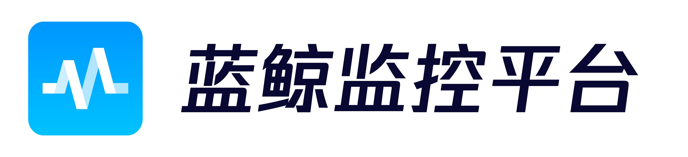

---

`bkmonitor-ecosystem` 提供「最小化」开箱即用的观测数据接入 demo，帮助用户快速入门蓝鲸观测平台功能。

## 📦 开箱即用

我们以语言为维度，提供可通过 Docker 运行的样例，可结合具体场景参考文档及代码进行接入。

[各语言文档及上报样例汇总(外部（GitHub）版)](docs/open/)

[各语言文档及上报样例汇总（内部版）](docs/inner/README.md)

## Support
- [产品文档](https://bk.tencent.com/docs/document/6.0/134/6143)
- [蓝鲸论坛](https://bk.tencent.com/s-mart/community)

## BlueKing Community
* [BK-CMDB](https://github.com/Tencent/bk-cmdb)：蓝鲸配置平台（蓝鲸 CMDB）是一个面向资产及应用的企业级配置管理平台。
- [BK-CI](https://github.com/Tencent/bk-ci)：蓝鲸持续集成平台是一个开源的持续集成和持续交付系统，可以轻松将你的研发流程呈现到你面前。
- [BK-BCS](https://github.com/Tencent/bk-bcs)：蓝鲸容器管理平台是以容器技术为基础，为微服务业务提供编排管理的基础服务平台。
- [BK-PaaS](https://github.com/Tencent/bk-PaaS)：蓝鲸 PaaS 平台是一个开放式的开发平台，让开发者可以方便快捷地创建、开发、部署和管理 SaaS 应用。
- [BK-SOPS](https://github.com/Tencent/bk-sops)：标准运维（SOPS）是通过可视化的图形界面进行任务流程编排和执行的系统，是蓝鲸体系中一款轻量级的调度编排类 SaaS 产品。

## Contributing
如果你有好的意见或建议，欢迎给我们提 Issues 或 Pull Requests，为蓝鲸开源社区贡献力量。关于 bk-monitor 分支管理、Issue 以及 PR 规范，
请阅读 [Contributing Guide](docs/CONTRIBUTING.md)。

[腾讯开源激励计划](https://opensource.tencent.com/contribution) 鼓励开发者的参与和贡献，期待你的加入。

## License
项目基于 MIT 协议， 详细请参考 [LICENSE](LICENSE.txt) 。