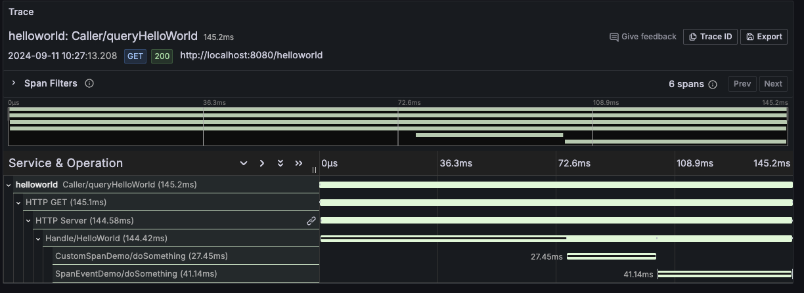

# HelloWorld 样例说明



## 1. 请求模型

```shell
+---------+                  +---------+
| Client  |                  | Server  |
+---------+                  +---------+
     |    /helloworld (per 3s)    |
     |--------------------------->|
     | "Hello World, {country}!"  |
     |<---------------------------|
     |                            |
```

### 1.1 服务端（Server）

运行 HTTP 服务，监听 8080 端口。

处理 `/helloworld` 请求。

正常情况下，返回 `Hello World, {country}!` 给客户端。

`country` 可选项：`["United States", "Canada", "United Kingdom", "Germany", "France", "Japan", "Australia", "China", "India", "Brazil"]`。

按 **10 %** 概率随机抛出一个异常，返回 `{error}` 给客户端。

`error` 可选项：
* errMySQLConnectTimeout：`mysql connect timeout`
* errUserNotFound：`user not found`
* errNetworkUnreachable：`network unreachable`
* errFileNotFound：`file not found`

### 1.2 客户端（Client）

每隔 3 s 访问一次 Server。

## 2. 场景

所提供样例尽可能抽象成函数，通过多个函数调用的形式紧凑，便于阅读，例如：

```go
func HelloWorld(w http.ResponseWriter, req *http.Request) {
	// Logs（日志）
	logsDemo(ctx, req)

	// Metrics（指标） - Counter 类型
	metricsCounterDemo(ctx, country)
	// Metrics（指标） - Histograms 类型
	metricsHistogramDemo(ctx)

	// Traces（调用链）- 自定义 Span
	tracesCustomSpanDemo(ctx)
	// Traces（调用链）- Span 事件
	tracesSpanEventDemo(ctx)
	// Traces（调用链）- 模拟错误
	if err := tracesRandomErrorDemo(ctx, span); err != nil {
		http.Error(w, err.Error(), http.StatusInternalServerError)
		return
	}

	w.Write([]byte(greeting))
}
```

参考 <a href="../../go/otlp/README.md" target="_blank">Go（OpenTelemetry SDK）接入</a>「使用场景」部分，提供 Traces / Metrics / Logs / Profiling 的上报样例。

函数名称、指标名称/维度等尽可能保持一致。