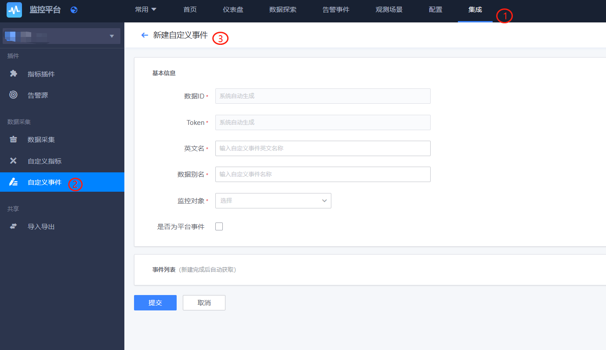
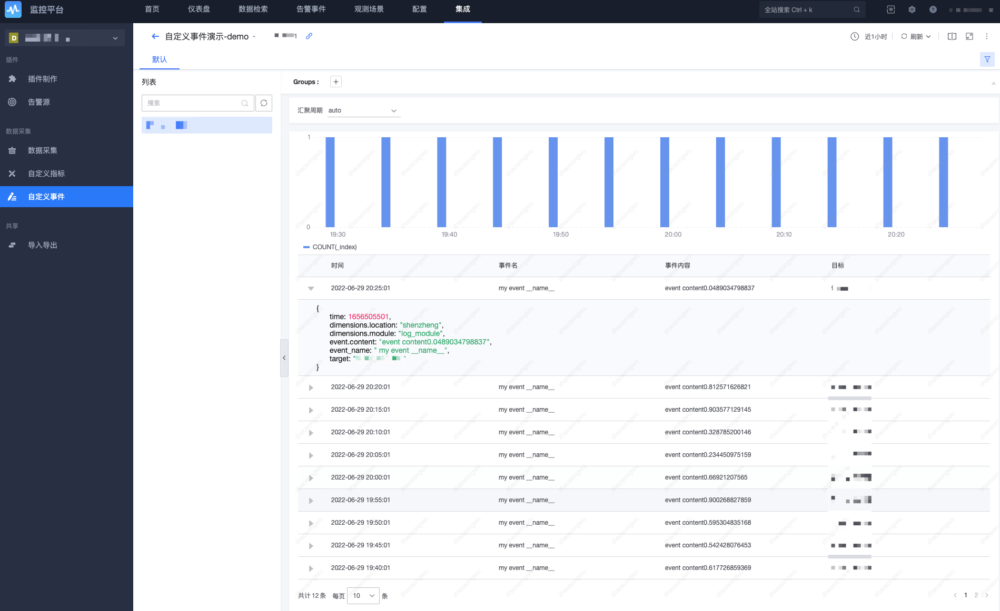
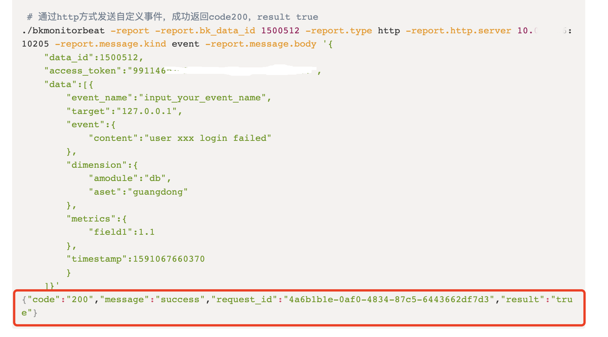

# 自定义事件上报

## 1. 概述

自定义事件上报用于将业务应用产生的事件数据接入监控系统的一种方式。可以通过 HTTP 或命令行工具（如 bkmonitorbeat）进行上报。

## 2. 准备开始

### 2.1 新建自定义事件

自定义上报的数据需要预先分配数据 ID 和　Token，新建自定义事件：

* 监控对象：该事件的分类，可以根据实际情况选择

* 是否为平台事件：默认无需勾选，如勾选后，其他业务能够看到上报的内容




### 2.2 上报速率限制

默认的 API 接收频率，单个 dataid 限制 1000 次／ min，单次上报 Body 最大为 500 KB。

如超过频率限制，请联系`蓝鲸助手`调整。

### 2.3 数据协议

Arguments

| 参数名称           | 类型              | 描述                                                                                           |
|----------------|-----------------|----------------------------------------------------------------------------------------------|
| `data_id`      | Integer         | ❗❗【非常重要】标识上报的数据类型，配置为应用数据 `ID`。                                                              |
| `access_token` | String          | ❗❗【非常重要】认证令牌，用于接口鉴定，配置为应用 `TOKEN`。                                                           |
| `data`         | List<EventData> | 上报事件列表，支持同时上报多跟事件。                                                                           |
| `API_URL`      | String          | ❗❗【非常重要】数据上报接口地址（`Access URL`），国内站点请填写「 http://127.0.0.1:10205/v2/push/ 」，其他环境、跨云场景请根据页面接入指引填写 |

EventData

| 参数名称         | 类型                  | 描述                                       |
|--------------|---------------------|------------------------------------------|
| `event_name` | String              | 事件标识名，最大长度 128。                          |
| `target`     | String              | 来源 IP，请使用本机 IP。                          |
| `dimensions` | Map<String, String> | 维度，`k-v` 格式。                             |
| `timestamp`  | Long             　  | 【可选】数据时时间，毫秒级别时间戳，如不提供，将默认设置 API 请求接收时间。 |

Event

| 参数名称      | 类型                   | 描述    |
|-----------|----------------------|-------|
| `count`   | Integer              | 事件数量。 |
| `content` | String             　 | 事件内容。 |

请求参数示例：

```shell
#!/bin/bash
#　❗❗【非常重要】API_URL：数据上报接口地址（`Access URL`），国内站点请填写「 http://127.0.0.1:10205/v2/push/ 」，其他环境、跨云场景请根据页面接入指引填写。
# ❗❗【非常重要】 data_id：标识上报的数据类型，配置为应用数据 ID。
# ❗❗【非常重要】access_token：认证令牌，用于接口鉴定，配置为应用 TOKEN。
# event_name：事件标识名，最大长度128。
# event：事件详细内容。
# content：事件具体内容文字描述。
# target：修改为自己的设备IP。
# timestamp：数据时间，精确到毫秒。
REPORT_DATA='{
    "data_id": fixme,
    "access_token": "fixme:替换为申请到的 Token",
    "data": [{
        "event_name": "input_your_event_name",
        "event": {
            "content": "user xxx login failed"
        },
        "target": "127.0.0.1",
        "dimension": {
            "module": "db",
            "location": "guangdong"
        },
        "timestamp": '"$(date +%s%3N)"'
    }]
}'

API_URL="http://127.0.0.1:10205/v2/push/"

curl -g -X POST ${API_URL} -d "${REPORT_DATA}"
```

响应示例：

```shell
{"code":"200","result":"true","message":""}
```

## 3. 快速接入

### 3.1 数据上报示例

* 了解 <a href="https://github.com/TencentBlueKing/bkmonitor-ecosystem/blob/master/docs/cookbook/Quickstarts/events/http/bkmonitorbeat.md" target="_blank">命令行-事件（bkmonitorbeat）上报</a>。

* 了解 <a href="https://github.com/TencentBlueKing/bkmonitor-ecosystem/blob/master/docs/cookbook/Quickstarts/events/http/curl.md" target="_blank">命令行-事件（HTTP）上报</a>。

* 了解 <a href="https://github.com/TencentBlueKing/bkmonitor-ecosystem/blob/master/docs/cookbook/Quickstarts/events/http/python.md" target="_blank">Python-事件（HTTP）上报</a>。

* 了解 <a href="https://github.com/TencentBlueKing/bkmonitor-ecosystem/blob/master/docs/cookbook/Quickstarts/events/http/java.md" target="_blank">Java-事件（HTTP）上报</a>。

### 3.2 查看数据

上报后会有 0-10 分钟的延迟，等待系统完成后台数据的同步，请耐心等待。如超时 10 分钟仍无数据，请联系 `BK 助手`。



## 4. 常见问题

### 4.1 FAQ

#### 4.1.1 能否通过事件 API 返回码判断事件是否入库？



Q：用这种方式根据返回 code 判断，是不是简单一些？返回 code 200 是不是能说明消息发送成功到达事件中心了？

A：不一定。200 只是认为消息以及投递到平台的接收器而已，但是接收器到入库、告警判断及告警事件产生还有其他的流程。

#### 4.1.2 上报时间超过 10 分钟，页面获取不到数据

Q：自定义事件上报，返回值正常，数据上报时间已超过 10 分钟，但页面获取不到数据。

A：排查所属管控区域是否正确；检查是否安装了 bk-collector 插件以及插件状态是否正常；
检查上报数据的格式。如果发现时间戳参数设置有误，修正时间戳格式后重新触发一次事件，等待新数据上传即可；

### 4.2 更多问题

* <a href="#" target="_blank">自定义事件无数据</a>。

## 5. 了解更多

* <a href="#" target="_blank">事件数据接入</a>。

* <a href="#" target="_blank">主机事件</a>。

* <a href="#" target="_blank">容器事件</a>。