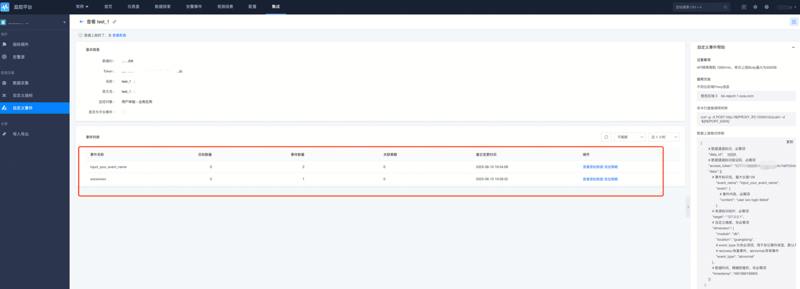
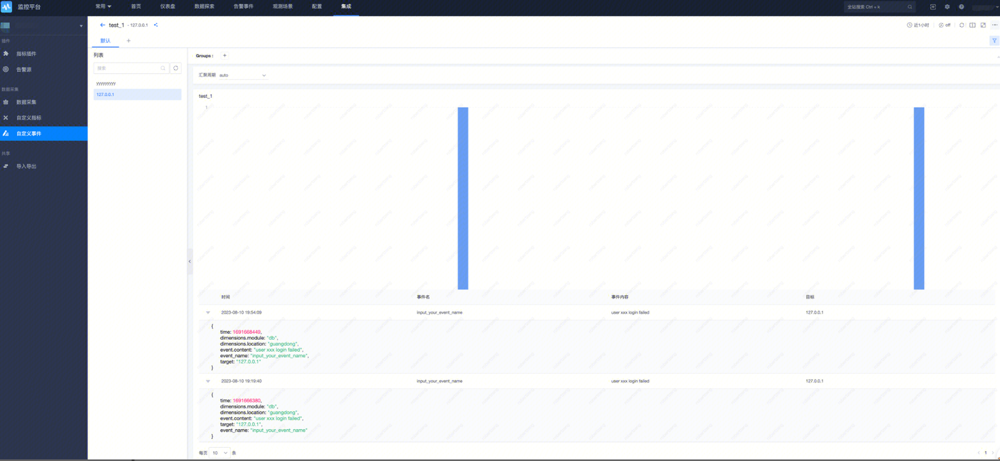

# 命令行-事件（bkmonitorbeat）上报

## 1. 概述

自定义上报可以通过命令行工具进行上报， 实现发送自定义事件/自定义时序等自定义数据。

支持通过 `GSE Agent` 和 通过 `HTTP` 两种方式实现自定义上报， 上报之前会在本地进行 `jsonschema` 校验。

## 2. 准备开始

### 2.1 申请数据 ID

参考 <a href="https://github.com/TencentBlueKing/bkmonitor-ecosystem/blob/main/docs/cookbook/Quickstarts/events/http/README.md" target="_blank">自定义事件 HTTP 上报</a> 创建自定义事件后需关注提供的两个配置项：

* `TOKEN`：自定义事件数据源 Token，上报数据时使用。

* `数据 ID`: 数据 ID（Data ID），自定义事件数据源唯一标识，上报数据时使用。

同时，阅读上述文档「上报数据协议」章节。


### 2.2 安装 bkmonitorbeat 插件

检查主机是否已安装监控采集器（`bkmonitorbeat`）：

```shell
ps -ef | grep bkmonitorbeat
root        5400       1  0 May10 ?        15:08:25 ./bkmonitorbeat -c ../etc/bkmonitorbeat.conf
```

如未安装，请参考<a href="https://bk.tencent.com/docs/markdown/ZH/Monitor/3.9/UserGuide/ProductFeatures/collectors/install.md" target="_blank">监控采集器安装</a>。

### 2.3 获取 bkmonitorbeat 路径

#### 2.3.1 上云环境

Linux：

* GSE Agent 的安装路径：`/usr/local/gse2_bkte`。

* GSE Agent Data IPC （进程间通信）路径：`/usr/local/gse2_bkte/agent/data/ipc.state.report`。

* 监控采集器（bkmonitorbeat）安装路径：`/usr/local/gse2_bkte/plugins/bin/bkmonitorbeat`。

#### 2.3.2 出海环境（新加坡）

 Linux：

* GSE Agent 的安装路径：`/usr/local/gse2_sg`。

* GSE Agent Data IPC （进程间通信）路径：`/usr/local/gse2_sg/agent/data/ipc.state.report`。

* 监控采集器（bkmonitorbeat）安装路径：`/usr/local/gse2_sg/plugins/bin/bkmonitorbeat`。

#### 2.3.3 其他环境确认方式

1）获取 GSE Agent 安装路径：

```shell
ps -ef | grep gse
```

该命令将输出 GSE Agent 安装目录、配置文件路径等信息：

```shell
root     76989     1  0 Apr03 ?        00:00:00 ./gse_agent -f /usr/local/gse2_bkte/agent/etc/agent.conf
root     76990 76989  0 Apr03 ?        00:03:15 ./gse_agent -f /usr/local/gse2_bkte/agent/etc/agent.conf
```

2）获取 GSE Agent Data IPC（（进程间通信））路径：

根据上文获取 `GSE Agent` 的配置，（如 `/usr/local/gse2_bkte(或 gse2_sg)/agent/etc/agent.conf`），查看 `dataipc` 配置值。

3）获取监控采集器（bkmonitorbeat）安装路径：

根据 `GSE Agent` 安装目录，如 `/usr/local/gse_xxx/`，补充 `plugins/bin/bkmonitorbeat` 得到 `bkmonitorbeat` 的路径 `/usr/local/gse_xxx/plugins/bin/bkmonitorbeat`。

## 3. 命令行使用方法

以下示例以「上云环境」的安装路径为例，其他环境请根据「2.3 获取 bkmonitorbeat 路径 」获取并替换。

### 3.1 命令行参数

查看 HELP：

```shell
cd /usr/local/gse2_bkte/plugins/bin/
:!./bkmonitorbeat -h
```

输出：

```shell
Usage of /usr/local/gse2_bkte/plugins/bin/bkmonitorbeat:
  -E value
        Configuration overwrite
  -N    Disable actual publishing for testing
  -T    TestMode is for testing purpose which will only run task once
  -V    Log at INFO level
  -c value
        Configuration file, relative to path.config (default beat.yml)
  -container
        Running as container mode
  -cpuprofile string
        Write cpu profile to file
  -d value
        Enable certain debug selectors
  -disable-normalize
        If present, disable data normalization
  -e    Log to stderr and disable syslog/file output
  -fakeproc string
        Show the real pid of the mapping process info
  -gse-check
        If present, checking gse connection then exit
  -httpprof string
        Start pprof http server
  -memprofile string
        Write memory profile to this file
  -path.config value
        Configuration path
  -path.data value
        Data path
  -path.home value
        Home path
  -path.logs value
        Logs path
  -reload
        Reload the program
  -report
        Report event to time series to bkmonitorproxy
  -report.agent.address string
        agent ipc address, default /var/run/ipc.state.report (default "/var/run/ipc.state.report")
  -report.bk_data_id int
        bk_data_id, required
  -report.event.content string
        event content
  -report.event.name string
        event name
  -report.event.target string
        event target
  -report.event.timestamp int
        event timestamp
  -report.http.server string
        http server address, required if report type is http
  -report.http.token string
        token, , required if report type is http
  -report.message.body string
        message content that will be send, json format
  -report.message.kind string
        message kind, event or timeseries
  -report.type http
        report type, http or `agent`
  -strict.perms
        Strict permission checking on config files (default true)
  -v    display version
  -verbose
        show message body
```

| 参数名称     | 类型                | 描述                          |
| ------------ | ------------------- | ---------------------------- |
|`report.bk_data_id`       |  Integer     | ❗❗【非常重要】 数据 ID（Data ID），自定义事件数据源唯一标识。   |
|`report.agent.address`    |  String      | GSE Agent Data IPC（（进程间通信））路径。  |
|`report.http.token`       |  String      | ❗❗【非常重要】 自定义事件数据源 Token。   |
|`report.http.server`      |  String      | ❗❗【非常重要】  数据上报接口地址，国内站点请填写「 http://127.0.0.1:10205/v2/push/ 」，其他环境、跨云场景请根据页面接入指引填写。  |
|`report.event.timestamp`  |  Long        | 毫秒级别时间戳，如不指定，则默认采用系统时间。   |
|`report.type`             |  String      | 报告的类型标识符。   |
|`report.message.body`     |  String      | 消息的主体内容，包含核心信息或详细数据。  |
|`report.message.kind`     |  String      | 消息的种类，用于区分信息级别（如 "INFO"、"WARN"、"ERROR"）或消息类别。  |
|`report.event.target`     |  String      | 关联事件的目标对象标识，如主机名。   |
|`report.event.name`       |  String      | 关联事件的名称，用于标识具体发生的事件类型。   |
|`report.event.content`    |  String      | 关联事件的具体内容，包含事件的详细描述或原始数据。  |

### 3.2 使用样例

基本使用方法通用，适用于事件和时序数据上报；事件涉及到较多特殊字段处理，后续单独介绍针对自定义事件的上报方法。如下代码演示用于发送自定义事件的数据（其中 JOSN 内容来自监控插件配置右侧的帮助信息）。

#### 3.2.1 通过 GSE AGENT 发送自定义事件

```shell
# 通过 GSE Agent 发送自定义事件，无返回
#  ❗❗【非常重要】 data_id 标识上报的数据类型，配置为应用数据 ID。
#  ❗❗【非常重要】 access_token 认证令牌，用于接口鉴定，配置为应用 TOKEN。
#  ❗❗【非常重要】report.agent.address：GSE Agent Data IPC（（进程间通信））路径。
# 上云环境 report.agent.address：/usr/local/gse2_bkte/agent/data/ipc.state.report
# 新加坡环境 report.agent.address：/usr/local/gse2_sg/agent/data/ipc.state.report

cd /usr/local/gse2_bkte/plugins/bin/

./bkmonitorbeat -report -report.bk_data_id 0000000 \
-report.type agent \
-report.message.kind event \
-report.agent.address /usr/local/gse2_bkte/agent/data/ipc.state.report \
-report.message.body '{
    "data_id": 0000000,
    "access_token": "xxxxxxxxxxxxxxxxx",
    "data": [{
        "event_name": "input_your_event_name",
        "event": {
            "content": "user xxx login failed"
        },
        "target": "127.0.0.1",
        "dimension": {
            "module": "db",
            "location": "guangdong"
        },
        "timestamp": "$(date +%s%3N)"
    }]
}'
```

#### 3.2.2 通过 HTTP 方式上报自定义事件数据

``` shell
#  ❗❗【非常重要】 data_id 标识上报的数据类型，配置为应用数据 ID。
#  ❗❗【非常重要】 access_token 认证令牌，用于接口鉴定，配置为应用 TOKEN。
#  ❗❗【非常重要】数据上报接口地址（`Access URL`），国内站点请填写「 http://127.0.0.1:10205/v2/push/ 」，其他环境、跨云场景请根据页面接入指引填写。

cd /usr/local/gse2_bkte/plugins/bin/

./bkmonitorbeat -report \
-report.bk_data_id 0000000 \
-report.type http \
-report.http.server http://127.0.0.1:10205/v2/push/ -report.message.kind event \
-report.message.body '{
    "data_id": 0000000,
    "access_token": "xxxxxxxxxxxxxxxxx",
    "data": [{
        "event_name": "input_your_event_name",
        "event": {
            "content": "user xxx login failed"
        },
        "target": "127.0.0.1",
        "dimension": {
            "module": "db",
            "location": "guangdong"
        }
    }]
}'
```

#### 3.2.3 单独指定各个上报字段的方式

本示例采用单独指定各个上报字段的方式，用于解决拼装 JSON 麻烦的问题。

通过 GSE Agent 上报自定义事件数据。

```shell
# 通过指定各个字段的方式发送自定义事件数据，如不指定 -report.event.timestamp，则默认采用系统时间。
#  ❗❗【非常重要】report.bk_data_id：标识上报的数据类型，配置为应用数据 ID。
#  ❗❗【非常重要】report.agent.address：GSE Agent Data IPC（（进程间通信））路径。
# ❗❗【非常重要】report.event.timestamp：毫秒级别时间戳，如不指定 -report.event.timestamp，则默认采用系统时间。

cd /usr/local/gse2_bkte/plugins/bin/

./bkmonitorbeat -report \
-report.type agent \
-report.agent.address /usr/local/gse2_bkte/agent/data/ipc.state.report \
-report.message.kind event \
-report.bk_data_id 0000000 \
-report.event.target 127.0.0.1 \
-report.event.name xxxxxxxxx \
-report.event.target yyyyyyyyy \
-report.event.content zzzzzz \
-report.event.timestamp 16916686860000
```

通过 HTTP 方式上报自定义事件数据

```shell
#  ❗❗【非常重要】report.http.token：认证令牌，用于接口鉴定，配置为应用 TOKEN。
#  ❗❗【非常重要】report.bk_data_id：标识上报的数据类型，配置为应用数据 ID。
#  ❗❗【非常重要】report.http.server：数据上报接口地址，国内站点请填写「 http://127.0.0.1:10205/v2/push/ 」，其他环境、跨云场景请根据页面接入指引填写。

cd /usr/local/gse2_bkte/plugins/bin/

./bkmonitorbeat -report \
-report.type http \
-report.http.server http://127.0.0.1:10205/v2/push/ \
-report.http.token xxxxxxxxxxxxxxxxx \
-report.message.kind event \
-report.bk_data_id 0000000 \
-report.event.target 127.0.0.1 \
-report.event.name xxxxxxxxx \
-report.event.target yyyyyyyyy \
-report.event.content zzzzzz
```

## 4. 查看数据

上报成功后可通过检查视图进行数据查看：



