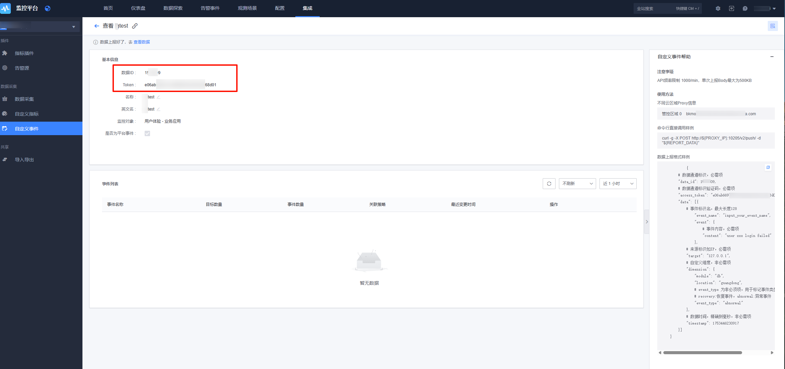

# go-事件（HTTP）上报

## 1. 前置准备

### 1.1 术语介绍

* <a href="https://github.com/TencentBlueKing/bkmonitor-ecosystem/blob/main/docs/cookbook/Quickstarts/events/http/README.md" target="_blank">自定义事件 HTTP 上报</a>

### 1.2 上报速率限制

默认的 API 接收频率，单个 dataid 限制 1000 次／ min，单次上报 Body 最大为 500 KB。

如超过频率限制，请联系`蓝鲸助手`调整。

### 1.3 初始化 demo

在开始之前，请确保您已经安装了以下软件：

* Git
* Docker 或者其他平替的容器工具。

```shell
git clone https://github.com/TencentBlueKing/bkmonitor-ecosystem
cd bkmonitor-ecosystem/examples/events/go
```

## 2. 快速接入


### 2.1 创建应用

参考 <a href="https://github.com/TencentBlueKing/bkmonitor-ecosystem/blob/main/docs/cookbook/Quickstarts/events/http/README.md" target="_blank">自定义事件 HTTP 上报</a> 创建自定义事件后需关注提供的两个配置项：

* `TOKEN`：自定义事件数据源 Token，上报数据时使用。

* `数据 ID`：数据 ID（Data ID），自定义事件数据源唯一标识，上报数据时使用。

同时，阅读上述文档「上报数据协议」章节。



**有任何问题可企微联系`蓝鲸助手`协助处理**。

### 2.2 样例运行参数

运行参数说明：

| 参数     | 类型                | 描述                         |
| ------------ | ------------------- | ---------------------------- |
|`TOKEN`       |String      |❗❗【非常重要】 自定义事件数据源 `Token`。  |
|`DATA_ID`     |Integer     |❗❗【非常重要】 数据 ID（`Data ID`），自定义事件数据源唯一标识。|
|`API_URL`     |String         |❗❗【非常重要】 数据上报接口地址（`Access URL`），国内站点请填写「 http://127.0.0.1:10205/v2/push/ 」，其他环境、跨云场景请根据页面接入指引填写。|
|`INTERVAL`    |Integer     |上报间隔（单位为秒），默认 60 秒上报一次。​ |

### 2.3 运行样例

示例代码也可以在样例仓库 <a href="https://github.com/TencentBlueKing/bkmonitor-ecosystem/tree/main/examples/events/go" target="_blank">bkmonitor-ecosystem/examples/events/go</a> 中找到。

通过 docker build 构建名为 events-http-go 的镜像，并使用 docker run 运行容器，同时通过环境变量 TOKEN、DATA_ID、API_URL 传递配置参数，实现周期上报事件：

```bash
docker build -t events-http-go .

docker run -e TOKEN="xxx" \
 -e DATA_ID=000000 \
 -e API_URL="http://127.0.0.1:10205/v2/push/" \
 -e INTERVAL=60 events-http-go
```

运行输出：

```bash
2026-03-23 07:02:12 | 事件上报服务启动 | 目标: 127.0.0.1 | 间隔: 60 秒
2026-03-23 07:02:12 | 生成事件数据:
[
  {
    "event_name": "cpu_alert",
    "event": {
      "content": "CPU告警: 80%"
    },
    "target": "127.0.0.1",
    "dimension": {
      "location": "guangdong",
      "module": "db"
    },
    "timestamp": 1774249332647
  }
]
2026-03-23 07:02:12 | 上报结果: success 上报成功
```

### 2.4 样例代码

```go
package main

import (
    "bytes"
    "encoding/json"
    "fmt"
    "io"
    "math/rand/v2"
    "net/http"
    "os"
    "strconv"
    "strings"
    "time"
)

func getEnv(key, fallback string) string {
    if v := strings.TrimSpace(os.Getenv(key)); v != "" {
        return v
    }
    return fallback
}

func getEnvInt(key string, fallback int) int {
    if v := strings.TrimSpace(os.Getenv(key)); v != "" {
        if n, err := strconv.Atoi(v); err == nil {
            return n
        }
    }
    return fallback
}

// ===== 环境变量配置 =====
var (
    // ❗️❗️【非常重要】数据上报地址，请根据页面指引提供的接入地址进行填写
    apiURL   = getEnv("API_URL", "")
    // ❗❗【非常重要】标识上报的数据类型，配置为应用数据 `ID`。
    dataID   = getEnvInt("DATA_ID", 0)
    // ❗❗【非常重要】认证令牌，用于接口鉴定，配置为应用 `TOKEN`。
    token    = getEnv("TOKEN", "")
    // 目标设备IP
    targetIP = getEnv("TARGET_IP", "127.0.0.1")
    // 上报间隔（秒）
    interval = getEnvInt("INTERVAL", 60)
    client = &http.Client{Timeout: 5 * time.Second}
)

// Event 表示单个事件的数据结构
type Event struct {
    // 事件标识名
    EventName string `json:"event_name"`
    // 事件详细内容
    Event     struct {
        Content string `json:"content"`
    } `json:"event"`
    // 事件上报目标
    Target    string            `json:"target"`
    // 事件维度，具体字段及内容可自定义填写
    Dimension map[string]string `json:"dimension"`
    // 事件发生时间戳
    Timestamp int64             `json:"timestamp"`
}

// Payload 发送到API的完整请求体结构
type Payload struct {
    // ❗❗【非常重要】标识上报的数据类型，配置为应用数据 `ID`。
    DataID      int     `json:"data_id"`
    // ❗❗【非常重要】认证令牌，用于接口鉴定，配置为应用 `TOKEN`。
    AccessToken string  `json:"access_token"`
    Data        []Event `json:"data"`
}

// ===== 日志功能 =====
func logf(format string, args ...interface{}) {
    fmt.Printf("\033[1m%s\033[0m | %s\n",
        time.Now().Format("2006-01-02 15:04:05"), fmt.Sprintf(format, args...))
}

// sendEvents 发送事件并返回统一的 (status, message) 结构
func sendEvents() (string, string) {
    event := Event{
        EventName: "cpu_alert",
        Event:     struct{ Content string `json:"content"` }{Content: fmt.Sprintf("CPU告警: %d%%", rand.IntN(20)+80)},
        Target:    targetIP,
        Dimension: map[string]string{"module": "db", "location": "guangdong"},
        Timestamp: time.Now().UnixMilli(),
    }

    eventData := []Event{event}
    eventJSON, _ := json.MarshalIndent(eventData, "", "  ")
    logf("生成事件数据:\n%s", eventJSON)
    // ❗❗【非常重要】标识上报的数据类型，配置为应用数据 `ID`。
    // ❗❗【非常重要】认证令牌，用于接口鉴定，配置为应用 `TOKEN`。
    payload := Payload{DataID: dataID, AccessToken: token, Data: eventData}
    jsonData, _ := json.Marshal(payload)

    // ❗️❗️【非常重要】数据上报地址，请根据页面指引提供的接入地址进行填写
    req, _ := http.NewRequest("POST", apiURL, bytes.NewBuffer(jsonData))
    req.Header.Set("Content-Type", "application/json")

    resp, err := client.Do(req)
    if err != nil {
        return "error", fmt.Sprintf("上报失败: %v", err)
    }
    defer resp.Body.Close()
    defer io.Copy(io.Discard, resp.Body)

    if resp.StatusCode == 200 {
        return "success", "上报成功"
    }
    return "error", fmt.Sprintf("HTTP %d", resp.StatusCode)
}

func main() {
    logf("事件上报服务启动 | 目标: %s | 间隔: %d秒", targetIP, interval)

    for {
        status, message := sendEvents()
        color := map[bool]string{true: "\033[32m", false: "\033[31m"}[status == "success"]
        logf("上报结果: %s%s %s\033[0m", color, status, message)
        time.Sleep(time.Duration(interval) * time.Second)
    }
}
```

## 3. 了解更多

* <a href="#" target="_blank">事件数据接入</a>。

* <a href="#" target="_blank">主机事件</a>。

* <a href="#" target="_blank">容器事件</a>。