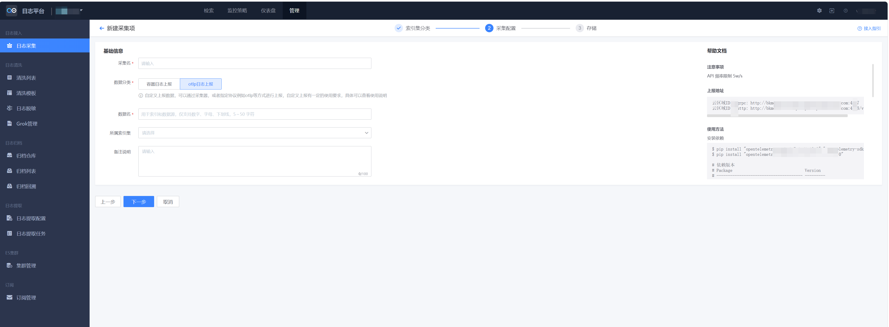
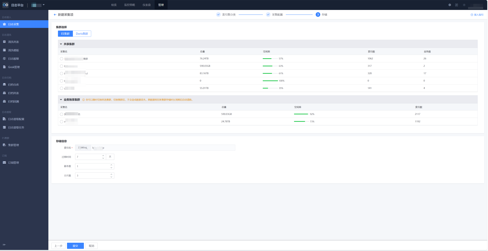

# 自定义日志 OpenTelemetry SDK 上报

## 1. 概述

自定义日志 SDK 上报用于将业务应用、中间件或其他系统产生的日志通过集成 SDK 的方式接入蓝鲸日志平台。日志可以通过 SDK 内置的协议自动上报，支持多种编程语言和日志框架的无缝集成。

SDK 上报适合应用侧希望低侵入、自动化地采集日志的场景。开发者只需在应用中引入对应语言的 SDK 并进行简单配置，SDK 会自动采集应用日志并上报到蓝鲸日志平台，无需手动编写上报逻辑或部署额外的采集器。

## 2. 准备开始

### 2.1 新建自定义日志

自定义日志上报前，需要先在页面创建自定义日志数据源，并完成基础信息和存储设置。

| 基础信息 | 存储设置 |
| --- | --- |
|  |  |

基础信息包括：

* 采集名：当前日志数据源的名称。
* 数据分类：日志所属分类。
* 数据名：日志数据源标识。
* 所属索引集：日志入库后用于检索的索引集。

存储设置包括：

* 存储集群：支持共享集群；如有业务独享集群，可以选择独享集群。
* 数据链路：选择已有数据链路进行日志上报。
* 存储参数：配置日志过期时间、副本数和分片数。

### 2.2 上报速率限制

OTLP 日志上报注意 API 频率限制 50,000 条/s。

如超过频率限制，请联系`蓝鲸助手`调整。

## 3. 快速接入

### 3.1 数据上报示例

* 了解 <a href="https://github.com/TencentBlueKing/bkmonitor-ecosystem/blob/master/docs/open/cookbook/Quickstarts/logs/sdks/python.md" target="_blank">Python-日志（OpenTelemetry SDK）上报</a>。

* 了解 <a href="https://github.com/TencentBlueKing/bkmonitor-ecosystem/blob/master/docs/open/cookbook/Quickstarts/logs/sdks/cpp.md" target="_blank">C++-日志（OpenTelemetry SDK）上报</a>。

* 了解 <a href="https://github.com/TencentBlueKing/bkmonitor-ecosystem/blob/master/docs/open/cookbook/Quickstarts/logs/sdks/java.md" target="_blank">Java-日志（OpenTelemetry SDK）上报</a>。

* 了解 <a href="https://github.com/TencentBlueKing/bkmonitor-ecosystem/blob/master/docs/open/cookbook/Quickstarts/logs/sdks/go.md" target="_blank">Go-日志（OpenTelemetry SDK）上报</a>。

另一种方式是通过 HTTP 上报自定义日志：

* 了解 <a href="https://github.com/TencentBlueKing/bkmonitor-ecosystem/blob/master/docs/open/cookbook/Quickstarts/logs/http/python.md" target="_blank">Python-日志（HTTP）上报</a>。

* 了解 <a href="https://github.com/TencentBlueKing/bkmonitor-ecosystem/blob/master/docs/open/cookbook/Quickstarts/logs/http/cpp.md" target="_blank">C++-日志（HTTP）上报</a>。

* 了解 <a href="https://github.com/TencentBlueKing/bkmonitor-ecosystem/blob/master/docs/open/cookbook/Quickstarts/logs/http/java.md" target="_blank">Java-日志（HTTP）上报</a>。

* 了解 <a href="https://github.com/TencentBlueKing/bkmonitor-ecosystem/blob/master/docs/open/cookbook/Quickstarts/logs/http/go.md" target="_blank">Go-日志（HTTP）上报</a>

### 3.2 查看数据

日志上报后，可以在对应索引集或日志检索页面查看数据。

如短时间内没有看到数据，请先确认以下信息：

* `TOKEN` 是否为当前日志数据源的 Token。

* `API_URL` 是否为页面接入指引提供的上报地址，OTLP HTTP 上报需要使用 `/v1/logs` 路径。

* `timeUnixNano` 是否为当前时间附近的纳秒时间戳。

* `service.name`、索引集和数据链路是否与页面配置一致。

* 索引集匹配：确认日志的 `service.name` 资源属性与页面配置的索引集规则一致，确保日志能被正确路由到目标索引集。

* 数据链路：确认业务网络策略未阻断 SDK 到蓝鲸日志平台上报地址的通信，如存在防火墙或代理，需配置白名单。

* SDK 日志级别：确认 SDK 配置的 `log_level` 未过滤掉目标级别的日志（例如配置为 ERROR 时，INFO 级别的日志不会上报）。

* SDK 运行状态：检查 SDK 启动日志，确认 SDK 初始化成功且与蓝鲸日志平台建立连接正常。

## 4. 常见问题

### 4.1 FAQ

#### 4.1.1 HTTP 返回成功后，为什么页面没有看到日志？

Q：请求返回成功，为什么页面没有看到日志？

A：HTTP 成功只代表接收侧已处理请求，不等于数据已经完成入库和索引刷新。请等待一段时间后重试，并检查 `TOKEN`、`API_URL`、数据链路、索引集和日志时间字段。

#### 4.1.2 什么时候用 Resources，什么时候用 Attributes？

Q：Resources 和 Attributes 都能放字段，应该怎么选择？

A：描述产生日志的实体时放到 Resources，例如服务名、环境、Pod 名称。描述某条日志事件本身时放到 Attributes，例如接口路径、请求方法、异常类型。

### 4.2 更多问题

* <a href="#" target="_blank">自定义日志无数据</a>。

## 5. 了解更多

进一步了解以下内容：

* 进行 <a href="#" target="_blank">日志检索</a>。

* 了解 <a href="#" target="_blank">容器日志自定义上报使用文档</a>。

* 了解 <a href="#" target="_blank">容器日志采集器安装</a>。