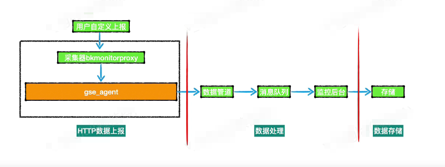
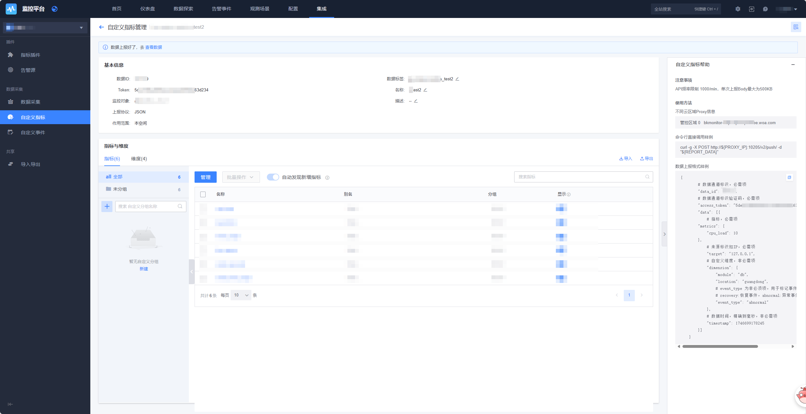
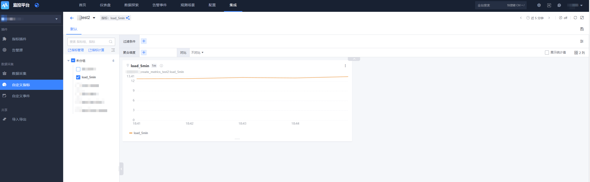

# 自定义指标 HTTP 上报

## 1. 概述

自定义上报是支持用户不安装 Agent 的情况下，直接通过 HTTP 上报的方式，例如在程序里面进行打点打报，或者用户通过定时任务上报。

自定义上报功能，支持 2 种数据类型，分别是事件（字符或日志类型）、指标（数值类型）。

HTTP 上报流程如下图示：



## 2. 准备开始

### 2.1 新建自定义指标

自定义上报的数据需要预先分配数据 ID 和　Token，请新建一个 JSON 上报类型的自定义指标：


新建完并有数据收报后进行指标管理。



### 2.2 上报速率限制

默认的 API 接收频率，单个 dataid 限制 1000 次／ min，单次上报 Body 最大为 500 KB。

如超过频率限制，请联系`蓝鲸助手`调整。

### 2.3 数据协议

Arguments

| 参数名称       | 类型             | 描述                                     |
| -------------- | ---------------- | ---------------------------------------- |
| `data_id`      | Integer          | ❗❗【非常重要】 数据 ID（`Data ID`），自定义指标数据源唯一标识。 |
| `access_token` | String           | ❗❗【非常重要】 自定义指标数据源 `Token`。             |
| `data`         | List<MetricData> | 指标数据。                               |

MetricData

| 参数名称     | 类型                | 描述                         |
| ------------ | ------------------- | ---------------------------- |
| `metrics`    | Map<String, Float>  | 指标名及指标值，`k-v` 格式。 |
| `target`     | String              | 来源 IP，请使用本机 IP。     |
| `dimensions` | Map<String, String> | 维度，`k-v` 格式。           |
| `timestamp`  |　  Long             |数据时间，精确到毫秒。          |

请求参数示例：

```shell
#!/bin/bash
load_5min=$(echo "scale=2; 70 + ($RANDOM / 327.67) * 25" | bc)
#　❗❗【非常重要】API_URL：数据上报接口地址（`Access URL`），国内站点请填写「 http://127.0.0.1:10205/v2/push/ 」，其他环境、跨云场景请根据页面接入指引填写。
API_URL=http://127.0.0.1:10205/v2/push/    #直连区域可填此IP。
# data_id: 修改为申请到的数据 ID。 ❗❗【非常重要】 数据 ID（`Data ID`），自定义指标数据源唯一标识。
# access_token:修改为申请到的 Token。 ❗❗【非常重要】 自定义指标数据源 `Token`。
# metrics：自定义所需的指标
# target：修改为自己的设备IP
REPORT_DATA='{
    "data_id": xxxxxx,
    "access_token": "5de7b38ed8xxxxxxx63d234",
    "data": [{
        "metrics": {
            "load_5min": '$load_5min'
        },
        "target": "127.0.0.1",
        "dimension": {
            "module": "db",
            "location": "guangdong"
        },
        "timestamp": '"$(date +%s%3N)"'
    }]
}'
# ❗❗【非常重要】 数据上报接口地址（`Access URL`），国内站点请填写「 http://127.0.0.1:10205/v2/push/ 」，其他环境、跨云场景请根据页面接入指引填写。
curl -g -X POST ${API_URL} -d "${REPORT_DATA}"
```

响应示例：

```shell
{"code":"200","result":"true","message":""}
```

## 3. 快速接入

### 3.1 数据上报示例

* 了解 <a href="https://github.com/TencentBlueKing/bkmonitor-ecosystem/blob/master/docs/cookbook/Quickstarts/metrics/http/curl.md" target="_blank">命令行-指标（HTTP）上报</a>。

* 了解 <a href="https://github.com/TencentBlueKing/bkmonitor-ecosystem/blob/master/docs/cookbook/Quickstarts/metrics/http/python.md" target="_blank">Python-指标（HTTP）上报</a>。

* 了解 <a href="https://github.com/TencentBlueKing/bkmonitor-ecosystem/blob/master/docs/cookbook/Quickstarts/metrics/http/cpp.md" target="_blank">C++-指标（HTTP）上报</a>。

* 了解 <a href="https://github.com/TencentBlueKing/bkmonitor-ecosystem/blob/master/docs/cookbook/Quickstarts/metrics/http/java.md" target="_blank">Java-指标（HTTP）上报</a>。

* 了解 <a href="https://github.com/TencentBlueKing/bkmonitor-ecosystem/blob/master/docs/cookbook/Quickstarts/metrics/http/go.md" target="_blank">Go-指标（HTTP）上报</a>。

### 3.2 查看数据

通过检查视图进行数据查看：



## 4. 常见问题

### 4.1 FAQ

#### 4.1.1 上报成功了，为什么没有到数据？

Q：刚上报成功了，为什么没有到数据？

A：需要自动发现维度和指标。对于新增的指标和维度字段大约会有最大 5 分钟的同步发现周期，
所以第一次需要等待一下，等待发现指标后，这时就可以查看这个指标的数据了。

#### 4.1.2 不同的自定义上报方式的区别？

Q：不同的自定义上报方式的区别？

A：HTTP 上报是有频率限制，主要是解决不想安装 agent 的情况。命令行工具和 SDK 都是依赖 agent 和 bkmonitorbeat 插件，所以性能也会好。

### 4.2 更多问题

* <a href="#" target="_blank">自定义上报根据不同协议上报</a>。

## 5. 了解更多

进一步了解以下内容：

* 进行 <a href="#" target="_blank">指标检索</a>。

* 了解 <a href="#" target="_blank">怎么使用监控指标</a>。

* 了解如何 <a href="https://bk.tencent.com/docs/markdown/ZH/Monitor/3.9/UserGuide/ProductFeatures/data-visualization/dashboard.md" target="_blank">配置仪表盘</a>。

* 了解如何使用 <a href="https://bk.tencent.com/docs/markdown/ZH/Monitor/3.9/UserGuide/ProductFeatures/alarm-configurations/rules.md" target="_blank">监控告警</a>。

另一种方式是通过 Prometheus SDK 上报自定义指标：

* 了解 <a href="https://github.com/TencentBlueKing/bkmonitor-ecosystem/blob/master/docs/cookbook/Quickstarts/metrics/sdks/README.md" target="_blank">Prometheus SDK 上报</a>。

* 了解 <a href="https://github.com/TencentBlueKing/bkmonitor-ecosystem/blob/master/docs/cookbook/Quickstarts/metrics/sdks/python.md" target="_blank">Python-指标（Prometheus SDK）上报</a>。

* 了解 <a href="https://github.com/TencentBlueKing/bkmonitor-ecosystem/blob/master/docs/cookbook/Quickstarts/metrics/sdks/cpp.md" target="_blank">C++-指标（Prometheus SDK）上报</a>。

* 了解 <a href="https://github.com/TencentBlueKing/bkmonitor-ecosystem/blob/master/docs/cookbook/Quickstarts/metrics/sdks/java.md" target="_blank">Java-指标（Prometheus SDK）上报</a>。

* 了解 <a href="https://github.com/TencentBlueKing/bkmonitor-ecosystem/blob/master/docs/cookbook/Quickstarts/metrics/sdks/go.md" target="_blank">Go-指标（Prometheus SDK）上报</a>。