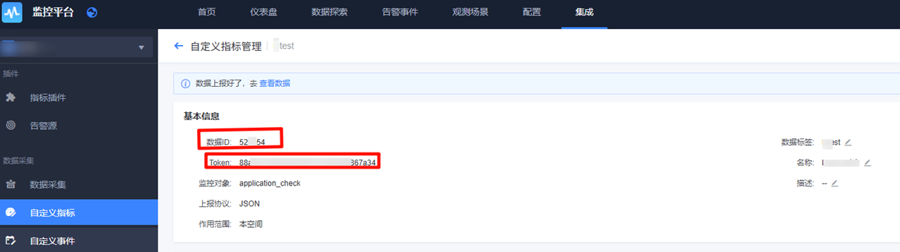

# java-指标（HTTP）上报

## 1. 前置准备

### 1.1 术语介绍

* <a href="https://github.com/TencentBlueKing/bkmonitor-ecosystem/blob/main/docs/cookbook/Term/metrics/what.md" target="_blank">什么是指标</a>

* <a href="{{COOKBOOK_METRICS_TYPES}}" target="_blank">指标类型</a>

### 1.2 开发环境要求

在开始之前，请确保您已经安装了以下软件：

* Git

* Docker 或者其他平替的容器工具。

### 1.3 初始化 demo

```shell
git clone https://github.com/TencentBlueKing/bkmonitor-ecosystem
cd bkmonitor-ecosystem/examples/metrics/http/java
```

## 2. 快速接入

### 2.1 创建应用

参考 <a href="https://github.com/TencentBlueKing/bkmonitor-ecosystem/blob/main/docs/cookbook/Quickstarts/metrics/http/README.md" target="_blank">自定义指标 HTTP 上报</a> 创建一个上报协议为 `JSON` 的自定义指标，关注创建后提供的两个配置项：

* `TOKEN`：自定义指标数据源 Token，上报数据时使用。

* `数据 ID`: 数据 ID（Data ID），自定义指标数据源唯一标识，上报数据时使用。
同时，阅读上述文档「上报数据协议」章节。



**有任何问题可企微联系`蓝鲸助手`协助处理**。

### 2.2 样例运行参数

运行参数说明：

| 参数         | 类型      | 描述                                                                                                 |
|------------|---------|----------------------------------------------------------------------------------------------------|
| `TOKEN`    | String  | ❗❗【非常重要】 自定义指标数据源 `Token`。                                                                               |
| `DATA_ID`  | Integer | ❗❗【非常重要】 数据 ID（`Data ID`），自定义指标数据源唯一标识。                                                                         |
| `API_URL`  | String  | ❗❗【非常重要】 数据上报接口地址（`Access URL`），国内站点请填写「 http://127.0.0.1:10205/v2/push/ 」，其他环境、跨云场景请根据页面接入指引填写。 |
| `INTERVAL` | Integer | 数据上报间隔，默认值为 60 秒。       ​​                                                             |

### 2.3 运行样例

示例代码也可以在样例仓库 <a href="https://github.com/TencentBlueKing/bkmonitor-ecosystem/tree/main/examples/metrics/http/java" target="_blank">bkmonitor-ecosystem/examples/metrics/http/java</a> 中找到。

复制以下命令参数在你的终端运行：

```bash
docker build -t metrics-http-java .

docker run -e TOKEN="xxx" \
 -e DATA_ID=00000 \
 -e API_URL="http://127.0.0.1:10205/v2/push/" \
 -e INTERVAL=60 metrics-http-java
```

运行输出：

```bash
🚀 启动指标上报服务
API地址: http://127.0.0.1:10205/v2/push/
数据ID: 00000
上报间隔: 60秒
=================================
[2025-10-24 15:14:59] ✅ 上报成功 | CPU: 0.00% 内存: 3.10%
[2025-10-24 15:15:29] ✅ 上报成功 | CPU: 11.40% 内存: 5.04%
[2025-10-24 15:15:59] ✅ 上报成功 | CPU: 11.86% 内存: 5.15%
...
```

### 2.4 样例代码

该样例通过模拟周期上报 CPU 及内存使用率（数值随机生成），演示如何进行自定义指标上报：

```java
import java.net.URI;
import java.net.http.HttpClient;
import java.net.http.HttpRequest;
import java.net.http.HttpResponse;
import java.nio.charset.StandardCharsets;
import java.text.SimpleDateFormat;
import java.time.Duration;
import java.util.Date;
import java.util.List;
import java.util.Map;
import java.util.Random;
import java.util.concurrent.TimeUnit;
import com.fasterxml.jackson.databind.ObjectMapper;

public class Main {
    // ❗❗【非常重要】数据上报接口地址（Access URL） 国内站点请填写「 http://127.0.0.1:10205/v2/push/ 」其他环境、跨云场景请根据页面接入指引填写
    private static final String API_URL = System.getenv("API_URL");
    // ❗❗【非常重要】认证令牌，用于接口鉴定，配置为应用 TOKEN
    private static final String TOKEN = System.getenv("TOKEN");
    // ❗❗【非常重要】data_id，标识上报的数据类型，配置为应用数据 ID
    private static final String DATA_ID = System.getenv("DATA_ID");
    // 上报间隔，默认为60秒
    private static final long INTERVAL = System.getenv("INTERVAL") != null
            ? Long.parseLong(System.getenv("INTERVAL")) : 60;

    private static final ObjectMapper OBJECT_MAPPER = new ObjectMapper();
    private static final Random RANDOM = new Random();
    private static final HttpClient HTTP_CLIENT = HttpClient.newBuilder()
            .connectTimeout(Duration.ofSeconds(10)).build();

    private static int sendReport(double cpuLoad, double memUsage) throws Exception {
        // 定义指定指标名及上报值
        Map<String, Object> metricsData = Map.of(
                "cpu_load", cpuLoad, "memory_usage", memUsage);
        // 定义上报维度
        Map<String, String> dimension = Map.of(
                "module", "server", "region", "guangdong");

        Map<String, Object> dataItem = Map.of(
                "metrics", metricsData,
                "target", "127.0.0.1",
                "dimension", dimension,
                // 设置上报时间
                "timestamp", System.currentTimeMillis());

        Map<String, Object> payload = Map.of(
                // ❗❗【非常重要】data_id，标识上报的数据类型，配置为应用数据 ID
                "data_id", Integer.parseInt(DATA_ID),
                // ❗❗【非常重要】认证令牌，用于接口鉴定，配置为应用 TOKEN
                "access_token", TOKEN,
                "data", List.of(dataItem));

        String requestBody = OBJECT_MAPPER.writeValueAsString(payload);

        HttpRequest request = HttpRequest.newBuilder()
                .uri(URI.create(API_URL))
                .header("Content-Type", "application/json")
                .header("Accept", "application/json")
                .POST(HttpRequest.BodyPublishers.ofString(
                        requestBody, StandardCharsets.UTF_8))
                .timeout(Duration.ofSeconds(10))
                .build();

        return HTTP_CLIENT.send(request,
                HttpResponse.BodyHandlers.ofString()).statusCode();
    }

    public static void main(String[] args) throws Exception {
        System.out.println("🚀 启动指标上报服务");
        System.out.println("API地址: " + API_URL);
        System.out.println("数据ID: " + DATA_ID);
        System.out.println("上报间隔: " + INTERVAL + "秒");
        System.out.println("=================================");

        SimpleDateFormat sdf = new SimpleDateFormat("yyyy-MM-dd HH:mm:ss");
        while (true) {
            double cpuLoad = RANDOM.nextDouble() * 100;
            double memUsage = RANDOM.nextDouble() * 100;
            int statusCode = sendReport(cpuLoad, memUsage);
            String timestamp = sdf.format(new Date());
            if (statusCode == 200) {
                System.out.printf(
                        "[%s] ✅ 上报成功 | CPU: %.2f%% 内存: %.2f%%\n",
                        timestamp, cpuLoad, memUsage);
            } else {
                System.out.printf("[%s] ❌ 上报失败 | 状态码: %d\n",
                        timestamp, statusCode);
            }

            TimeUnit.SECONDS.sleep(INTERVAL);
        }
    }
}
```

## 3. 了解更多

* 进行 <a href="#" target="_blank">指标检索</a>。

* 了解 <a href="#" target="_blank">怎么使用监控指标</a>。

* 了解如何 <a href="https://bk.tencent.com/docs/markdown/ZH/Monitor/3.9/UserGuide/ProductFeatures/data-visualization/dashboard.md" target="_blank">配置仪表盘</a>。

* 了解如何使用 <a href="https://bk.tencent.com/docs/markdown/ZH/Monitor/3.9/UserGuide/ProductFeatures/alarm-configurations/rules.md" target="_blank">监控告警</a>。