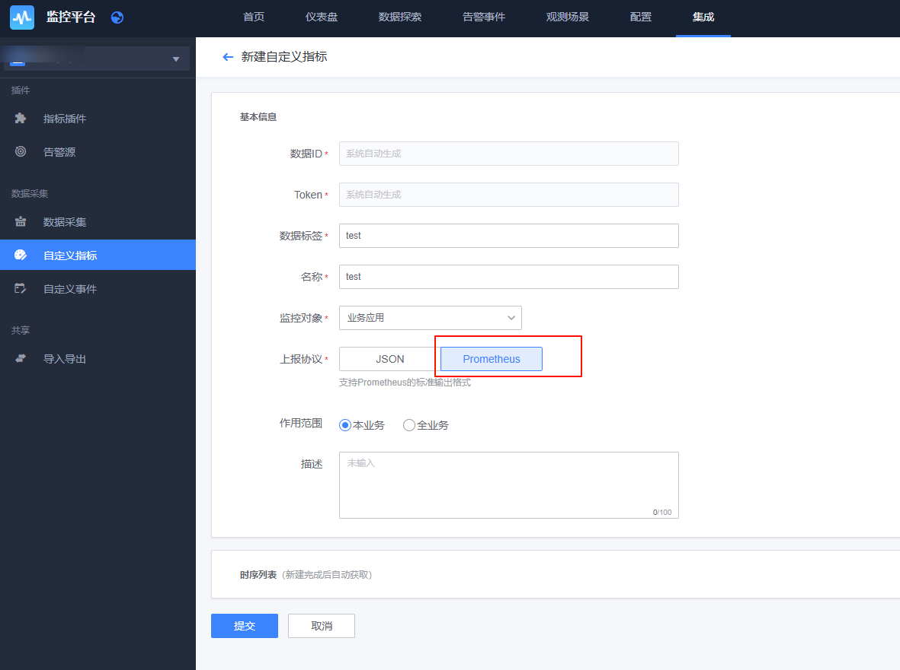
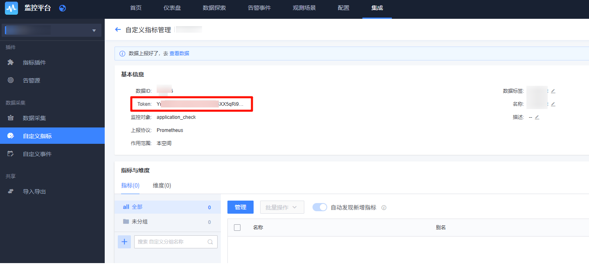
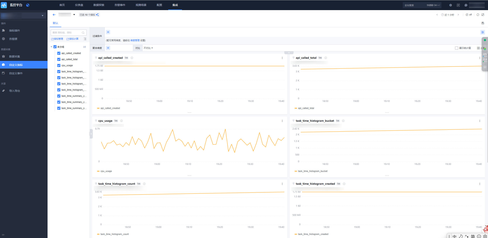

# 自定义指标 Prometheus SDK 上报

## 1. 概述

通过 `Prometheus SDK` 上报自定义指标（类 `Pushgateway` 方式）仅需两步：

* 1、安全认证配置：登录监控平台，进入「集成 → 自定义指标 → 选择 `Prometheus`」，提交后直接生成 `Token` 并获取配套文档；

* 2、SDK 接入鉴权：在代码中配置 `Token`，通过 `Header` 或 `URL` 参数传递完成校验。

**注： `Token` 及 `DataID` 等配置需采用外部化配置（如配置文件／环境变量），禁止硬编码。**

## 2. 准备开始

### 2.1 新建自定义指标

新建自定义指标，选择上报协议为 Prometheus ，提交后直接生成 `Token`。

### 2.2 上报速率限制

默认的 API 接收频率，单个 dataid 限制 1000 次／ min，单次上报 Body 最大为 500 KB。

如超过频率限制，请联系`蓝鲸助手`调整。

## 3. 快速接入

### 3.1 数据上报示例

* 了解 <a href="https://github.com/TencentBlueKing/bkmonitor-ecosystem/blob/master/docs/cookbook/Quickstarts/metrics/sdks/python.md" target="_blank">Python-指标（Prometheus SDK）上报</a>。

* 了解 <a href="https://github.com/TencentBlueKing/bkmonitor-ecosystem/blob/master/docs/cookbook/Quickstarts/metrics/sdks/cpp.md" target="_blank">C++-指标（Prometheus SDK）上报</a>。

* 了解 <a href="https://github.com/TencentBlueKing/bkmonitor-ecosystem/blob/master/docs/cookbook/Quickstarts/metrics/sdks/java.md" target="_blank">Java-指标（Prometheus SDK）上报</a>。

* 了解 <a href="https://github.com/TencentBlueKing/bkmonitor-ecosystem/blob/master/docs/cookbook/Quickstarts/metrics/sdks/go.md" target="_blank">Go-指标（Prometheus SDK）上报</a>。

### 3.2 查看数据

上报成功后可通过检查视图进行数据查看：

## 4. 常见问题

## 5. 了解更多

进一步了解以下内容：

* 进行 <a href="#" target="_blank">指标检索</a>。

* 了解 <a href="#" target="_blank">怎么使用监控指标</a>。

* 了解如何 <a href="https://bk.tencent.com/docs/markdown/ZH/Monitor/3.9/UserGuide/ProductFeatures/data-visualization/dashboard.md" target="_blank">配置仪表盘</a>。

* 了解如何使用 <a href="https://bk.tencent.com/docs/markdown/ZH/Monitor/3.9/UserGuide/ProductFeatures/alarm-configurations/rules.md" target="_blank">监控告警</a>。

另一种方式是通过 HTTP 上报自定义指标：

* 了解 <a href="https://github.com/TencentBlueKing/bkmonitor-ecosystem/blob/master/docs/cookbook/Quickstarts/metrics/http/README.md" target="_blank">自定义指标 HTTP 上报</a>。