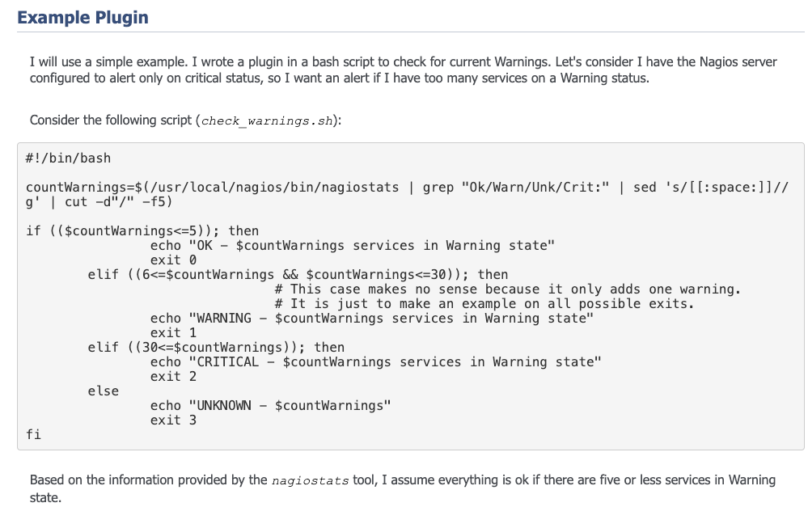
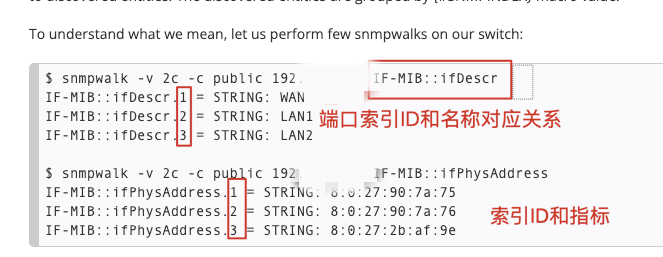
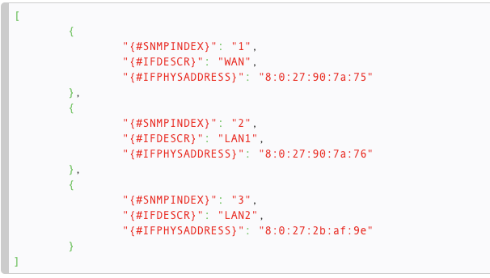
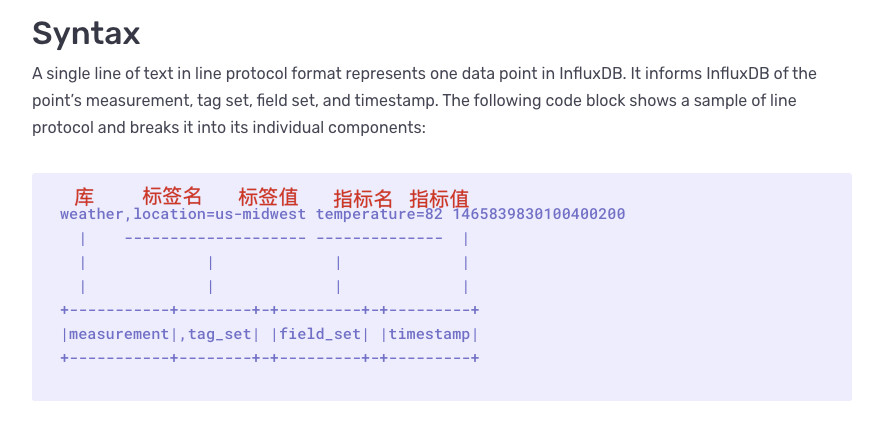
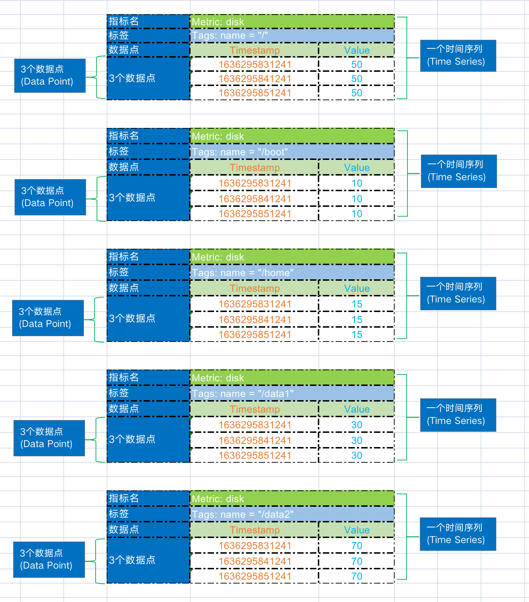

# 指标

## 1. 概述

在监控系统中，指标是一个很重要的概念，我们常常忽视他的存在。指标的定义，与监控系统所支持的数据模式结构，有着非常密切的关系。

监控数据的来源，从数据的类型可以分为：数值，短文本字符串，日志（长文本字符串）。通常所讲的指标，都是对当前系统环境具有度量价值的统计数据，使我们能够明确知道当前系统环境的运行状态。

## 2. 什么是指标？

指标是对软件属性或者硬件属性的度量。

监控对象所定义和暴露的一组的目标，需要与系统、业务程序、环境相紧密关联，建议遵循 SMART 原则：

* S （Specific，具体）指标是明确的，有具体的含义，反映具体的属性，有针对性的。

* M （Measurable，可衡量），指标是可量化、计算的，比如百分比、数值等。

* A （Assignable，可实现）指标的值可获取到，有技术手段或工具采集到。

* R （Realistic，相关性）与其他指标在逻辑上存在一定关联性。

* T （Time-bound，有时限）在一定的时间范围内取值跟踪。

## 3. 指标发展历史

### 3.1 退出码时期

在退出码期只关注指标的返回状态。

例如，在 Linux 系统中，脚本执行的退出的状态码有：

* `0`：执行成功。

* `1`：执行失败。

* `2-125`：系统保留错误码。

* `126-127`：权限与执行错误。

* `128-255`：信号中断与系统终止。

和 Linux 系统<a href="https://www.gnu.org/software/bash/manual/html_node/Exit-Status.html" target="_blank">退出状态码含义</a>相同的监控系统，最先在 <a href="https://www.howtoforge.com/tutorial/write-a-custom-nagios-check-plugin/" target="_blank">Nagios</a> 中使用，监控的检测脚本，通过 shell 脚本的退出状态码 0-3 这 4 个状态，来分别判断服务的不同运行状态，返回值的含义如下：

* `0`：Service is OK.

* `1`：Service has a WARNING.

* `2`：Service is in a CRITICAL status.

* `3`：Service status is UNKNOWN.

编写对应的检测脚本如下，然后由监控系统去判断服务的运行状态。



### 3.2 单指标时期

所谓单指标，指的是指标和值是成对出现的，即 k-v 键值对成对出现，典型代表监控为 <a href="https://www.zabbix.com/documentation/current/en/manual/discovery/low_level_discovery/examples/snmp_oids" target="_blank">Zabbix</a>。

比如，定义磁盘使用率状态，有多少个磁盘分区，则需要定义多少个指标，如下所示：

* disk_partition_used_percent["/"] 50
* disk_partition_used_percent["/boot"] 10
* disk_partition_used_percent["/home"] 15
* disk_partition_used_percent["/data1"] 50
* disk_partition_used_percent["/data2"] 50

单指标的缺点：

* 不能进行复杂条件查询，一次只能查询一个指标的值，比如需要查找所有机器最大磁盘分区的使用率，则需要将所有磁盘全部查出，再进行数据计算后，才能找到对应的值。

* 指标构造非常不方便，需要将指标进行拼接，比如 SNMP 的网络端口和端口对应的流量、包等指标进行关联，需要多次进行查询，才能将值取出，指标构造非常复杂。



最终构造的数据结构如下所示：



### 3.3 多维指标时期

多维指标，定义非常简单，指标名和单维度指标是一样的，只是将维度放到另外一个字段中。

* disk_partition_used_percent{name="/"} 50

* disk_partition_used_percent{name="/boot"} 10

* disk_partition_used_percent{name="/home"} 15

* disk_partition_used_percent{name="/data1"} 30

* disk_partition_used_percent{name="/data2"} 70

对比上面的单维度指标，多维指标有以下优点：

* 将同一类型的指标，不同名称的数据，归为一种数据进行查询。

  * 查询全部数据：不指定 name ，将返回所有的 name 值。

  * 选择 "/data"，"/data2" 多个分区，一次性返回查询数据。

* 指标名与维度分析，能更好的进行聚合，为复杂的数据计算、分析提供基础条件。

## 4. 什么是时序数据？

### 4.1 数据样本模型

时间序列是以规律的时间间隔采样的测量值的有序集合。

例如，每分钟采集一次主机 CPU 的使用率。时序数据有以下的概念：

| **字段**        | **描述**                            | **备注**              |
|---------------|-----------------------------------|---------------------|
| `Namespace`   | 命名空间                              | 类似于 `database`      |
| `Metric Name` | 指标名                               |                     |
| `Tags`        | 每个指标名下面可以多个 `Key/Value` 类型的 `Tag` |                     |
| `TagKey`      | 标签名                               |                     |
| `TagValue`    | 标签值                               |                     |
| `Value`       | 指标对应的值                            |                     |
| `Timestamp`   | 指标产生的时间                           | 如果不填写，则会以入库时间自动填充为准 |

下面以一个实际例子来对应各种时序数据的概念：


注意：这里的书写规则是按照 Prometheus 的个格式进行书写的，即：指标名｛标签名＝”标签值“｝值 - 时间戳。

当然，时序的指标还可以按照 <a href="https://docs.influxdata.com/influxdb/v1/write_protocols/line_protocol_tutorial/" target="_blank">influxDB line protocol</a>  来书写，如下所示：



### 4.2 时序模型

如下数据，采集了 3 条数据，则会产生 5 个时间序列，每个时间序列有 3 个数据点：

```shell
disk_partition_used_percent{name="/"} 50

disk_partition_used_percent{name="/boot"} 10

disk_partition_used_percent{name="/home"} 15

disk_partition_used_percent{name="/data1"} 30

disk_partition_used_percent{name="/data2"} 70
```



从上面可以看出，数据点就是采集的数据值。而时间序列是指标名中的维度乘积。时间序列计算的公式如下：

* `metric_name{taga="taga_value",tagb="tagb_value"} metric_value`
* `taga_value=[0 1 2 .... m]`
* `tagb_value=[0 1 2 .... n]`
* `time_series_total=count(taga_value) * count(tagb_value)=m * n`

## 5. 了解更多

进一步了解以下内容：

* 了解 <a href="{{COOKBOOK_METRICS_TYPES}}" target="_blank">指标类型</a>。

* 了解如何进行 <a href="https://github.com/TencentBlueKing/bkmonitor-ecosystem/blob/main/docs/cookbook/Quickstarts/metrics/http/README.md" target="_blank">自定义指标 HTTP 上报</a>。