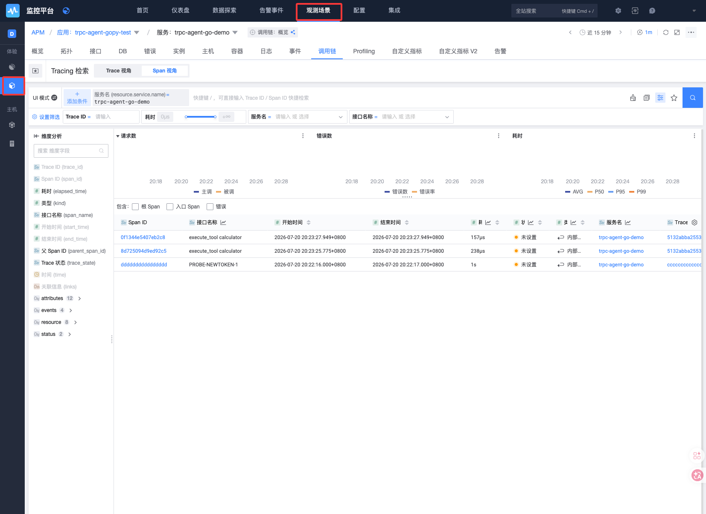
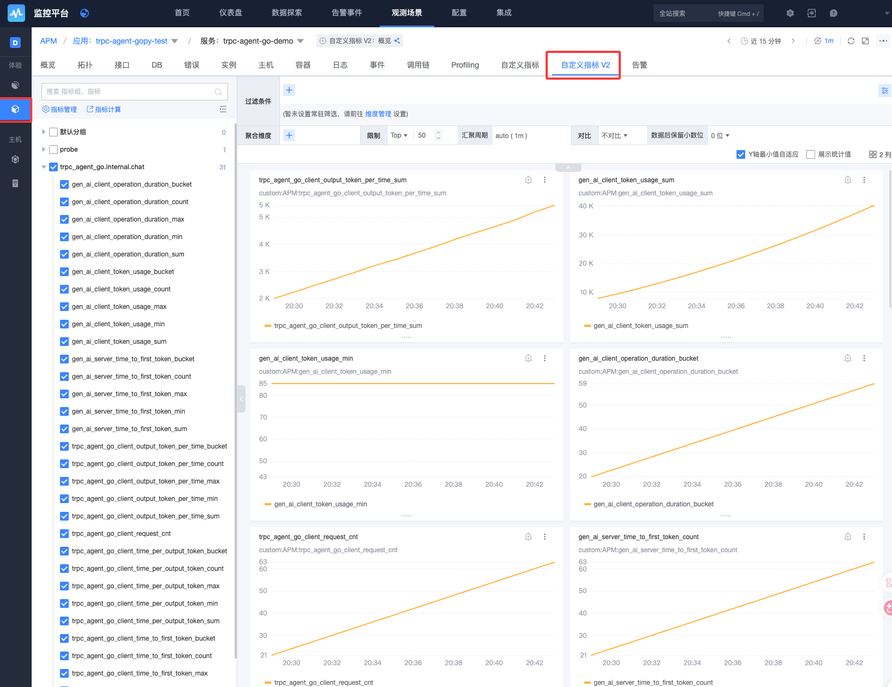
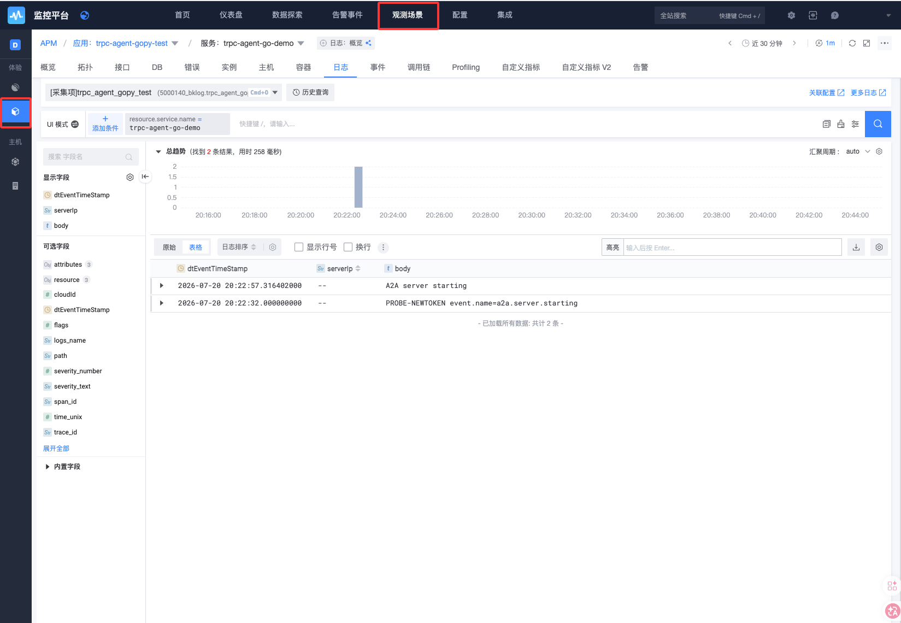

# Go（tRPC Agent Go）接入

本指南介绍如何复用 tRPC Agent Go 内置的 OpenTelemetry 埋点，将 Agent、模型调用和工具执行产生的 Traces、Metrics、Logs 上报到蓝鲸应用性能监控（APM）。

> ⚠️ **请先区分两个同名前缀的框架**：本示例接入的是 <a href="https://github.com/trpc-group/trpc-agent-go" target="_blank">tRPC Agent Go（Agent 框架）</a>，而不是 <a href="https://github.com/trpc-group/trpc-go" target="_blank">tRPC-Go（RPC 框架）</a>。

> **核心结论**：tRPC Agent Go 已经实现 Agent、LLM、Tool 和 Workflow 等框架执行路径的 OTel 埋点。业务不需要重复创建这些 Span 和 GenAI 指标，只需在进程启动时初始化一次 Provider 和 Exporter，配置数据上报地址、Token 和服务信息。

本文和配套样例只演示 **OTLP/HTTP** 上报。需要使用 OTLP/gRPC 时，请参考<a href="https://github.com/TencentBlueKing/bkmonitor-ecosystem/tree/main/docs/open/go/otlp/README.md" target="_blank">Go（OpenTelemetry SDK）接入</a>，本文不再重复提供 gRPC 初始化代码。

示例保留 A2A（Agent-to-Agent）调用边界，但只运行一个进程：

* Server goroutine：运行 A2A Server 和 Agent。
* Client goroutine：运行 `loopQuery`，通过 loopback A2A Client 定期调用同进程 Server，持续产生测试数据。

两个 goroutine 共享进程级 OTel Provider、配置和退出信号，不需要单独部署 Client。

## 1. 前置准备

请准备以下环境：

* Git。
* Docker 或其他兼容的容器工具。
* OpenAI API 兼容的模型服务及其 API Key。

获取并构建样例：

```shell
git clone https://github.com/TencentBlueKing/bkmonitor-ecosystem
cd bkmonitor-ecosystem/examples/go-examples/trpc-agent-go
docker build -t trpc-agent-go-apm:latest .
```

项目结构：

```text
trpc-agent-go/
├── main.go        # 初始化 Provider，启动两个 goroutine
├── client.go      # 进程内 A2A Client 的 loopQuery
├── telemetry.go   # OTLP/HTTP Trace、Metric、Log 初始化与关闭
└── Dockerfile
```

## 2. 快速接入

### 2.1 创建应用

参考 <a href="https://bk.tencent.com/docs/markdown/ZH/Monitor/3.9/UserGuide/ProductFeatures/scene-apm/apm_monitor_overview.md" target="_blank">APM 接入流程</a> 创建一个应用，接入指引会基于应用生成相应的上报配置，如下：


关注接入指引提供的两个配置项：

- `TOKEN`：上报唯一凭证。

- `OTLP_ENDPOINT`：数据上报地址。

有任何问题可企微联系 `BK助手` 协助处理。

### 2.2 接入

#### 2.2.1 添加依赖（如果依赖已集成，可以忽略）

tRPC Agent Go 已内置 OpenTelemetry 埋点和初始化接口。项目已使用该框架时无需增加其他观测 SDK；否则在 `go.mod` 中添加：

```go
require trpc.group/trpc-go/trpc-agent-go v1.10.0
```

#### 2.2.2 初始化 SDK

以下代码可以直接放入应用的 `main` 包。Provider 会在 Agent 和 Server 创建前完成初始化；Traces 必须初始化，否则全局 Tracer 不会上报数据。示例同时启用了可选的 Metrics。

```go
package main

import (
    "context"
    "errors"
    "fmt"
    "log"
    "net/url"
    "os"

    ametric "trpc.group/trpc-go/trpc-agent-go/telemetry/metric"
    atrace "trpc.group/trpc-go/trpc-agent-go/telemetry/trace"
)

func setupTelemetry(ctx context.Context) (func() error, error) {
    endpoint := os.Getenv("OTLP_ENDPOINT")
    token := os.Getenv("TOKEN")
    serviceName := os.Getenv("SERVICE_NAME")
    if endpoint == "" || token == "" || serviceName == "" {
        return nil, errors.New("OTLP_ENDPOINT, TOKEN and SERVICE_NAME are required")
    }

    // Metrics（可选）
    header := "x-bk-token=" + url.QueryEscape(token)
    if err := os.Setenv("OTEL_EXPORTER_OTLP_METRICS_HEADERS", header); err != nil {
        return nil, fmt.Errorf("set metrics headers: %w", err)
    }
    mp, err := ametric.NewMeterProvider(
        ctx,
        ametric.WithEndpoint(endpoint),
        ametric.WithProtocol("http"),
        ametric.WithServiceName(serviceName),
    )
    if err != nil {
        return nil, fmt.Errorf("create meter provider: %w", err)
    }
    if err := ametric.InitMeterProvider(mp); err != nil {
        shutdownErr := mp.Shutdown(ctx)
        return nil, errors.Join(fmt.Errorf("init meter provider: %w", err), shutdownErr)
    }

    // Traces（必须）
    shutdownTrace, err := atrace.Start(
        ctx,
        atrace.WithEndpoint(endpoint),
        atrace.WithProtocol("http"),
        atrace.WithHeaders(map[string]string{"x-bk-token": token}),
        atrace.WithServiceName(serviceName),
    )
    if err != nil {
        shutdownErr := mp.Shutdown(ctx)
        return nil, errors.Join(fmt.Errorf("start trace provider: %w", err), shutdownErr)
    }

    return func() error {
        return errors.Join(
            shutdownTrace(),
            mp.Shutdown(context.Background()),
        )
    }, nil
}

func main() {
    shutdownTelemetry, err := setupTelemetry(context.Background())
    if err != nil {
        log.Fatal(err)
    }
    defer func() {
        if err := shutdownTelemetry(); err != nil {
            log.Printf("shutdown telemetry: %v", err)
        }
    }()

    // 保留应用原有的 Agent 和 Server 启动逻辑。
}
```

完整初始化和关闭逻辑请参考 <a href="https://github.com/TencentBlueKing/bkmonitor-ecosystem/tree/main/examples/go-examples/trpc-agent-go/telemetry.go" target="_blank">telemetry.go</a>。该样例还通过 `otlploghttp` 和 `otelslog` 上报应用日志。

#### 2.2.3 关联配置

| 环境变量 | 必需 | 说明 |
| --- | --- | --- |
| `OTLP_ENDPOINT` | 是 | APM 接入指引提供的 HTTP OTLP 上报地址，格式为 `host:port`，不包含 URL Scheme 和 `/v1/*` 路径。 |
| `TOKEN` | 是 | APM 接入指引提供的应用 Token，通过 `x-bk-token` Header 上报。 |
| `SERVICE_NAME` | 是 | APM 应用内的服务唯一标识。 |

### 2.3 Demo 配置

| 环境变量 | 默认值 | 说明 |
| --- | --- | --- |
| `MODEL_API_KEY` | 无 | 【必须】模型服务 API Key，不要与 APM Token 混用。 |
| `MODEL_BASE_URL` | 空 | OpenAI API 兼容地址；使用 OpenAI 默认地址时留空。 |
| `MODEL_NAME` | `gpt-4o-mini` | 模型名称。 |
| `HOST` | `127.0.0.1:8080` | A2A Server 监听地址。 |
| `PROMPT` | 内置计算题 | `loopQuery` 发起的测试请求内容。 |
| `INTERVAL_SECONDS` | `30` | `loopQuery` 请求间隔；设为 `0` 时只请求一次。 |
| `DEBUG_OUTPUT` | `false` | 是否向标准输出打印 Prompt、模型输出和工具参数。只建议在无敏感数据的本地调试中开启。 |

## 3. 可观测数据

### 3.1 Traces

框架会自动创建 Runner、Agent、模型调用、Tool 和 Workflow Span，用于分析：

* 一次 Agent 请求经过的 Agent、模型和工具。
* 模型调用和工具执行耗时。
* 错误发生的执行阶段。
* 多 Agent、Graph 或 Workflow 的父子调用关系。

业务代码不需要重复创建这些 Span。只有需要观测框架无法感知的业务步骤时，才需要复用 `atrace.Tracer` 创建自定义 Span，并沿用 Runner 的 `context.Context`。

### 3.2 Metrics

tRPC Agent Go 内置的常用指标包括：

| 指标 | 说明 |
| --- | --- |
| `trpc_agent_go.client.request_cnt` | Agent、模型或工具请求次数。 |
| `gen_ai.client.operation.duration` | GenAI 操作耗时。 |
| `gen_ai.client.token.usage` | 输入、输出和缓存 Token 用量。 |
| `gen_ai.server.time_to_first_token` | 流式响应首 Token 耗时。 |
| `trpc_agent_go.client.time_per_output_token` | 平均每个输出 Token 的耗时。 |
| `trpc_agent_go.client.output_token_per_time` | 单位时间的输出 Token 数。 |
| `gen_ai.workflow.elapsed_time` | Workflow 生命周期区间耗时。 |

这些指标由框架自动记录。Histogram 在 APM 中会展开为 `_bucket`、`_count`、`_sum` 等序列。可通过 `OTEL_METRIC_EXPORT_INTERVAL` 调整导出间隔，单位为毫秒。

### 3.3 Logs

框架内置 OTel 埋点主要覆盖 Traces 和 Metrics，不会自动将所有应用日志作为 OTLP Logs 导出。样例额外上报一条 `event.name=a2a.server.starting` 的结构化启动日志，用于验证 Logs 链路。

框架的其他标准输出日志仍需通过日志采集器采集，或者按需接入 `otelslog`。日志正文和属性不应包含 Prompt、模型输出、API Key 或 APM Token。

## 4. 接入和验证

### 4.1 启动 Demo

```shell
cd examples/go-examples/trpc-agent-go
docker build -t trpc-agent-go-apm:latest .

docker run --rm --name trpc-agent-go-server \
  -p 8080:8080 \
  -e HOST="0.0.0.0:8080" \
  -e TOKEN="<APM 应用 Token>" \
  -e OTLP_ENDPOINT="<HTTP OTLP host:port>" \
  -e SERVICE_NAME="trpc-agent-go-demo" \
  -e MODEL_API_KEY="<模型 API Key>" \
  -e MODEL_BASE_URL="<可选的 OpenAI 兼容 Base URL>" \
  -e MODEL_NAME="<模型名称>" \
  -e PROMPT="Use the calculator to compute 12 * 7." \
  -e INTERVAL_SECONDS="30" \
  trpc-agent-go-apm:latest
```

进程启动后会创建两个主要 goroutine：一个运行 A2A Server，另一个运行 `loopQuery` Client。`loopQuery` 创建 A2A Client Runner，等待 Server 就绪后立即启动一次 `queryAgent`，随后按 `INTERVAL_SECONDS` 周期启动请求 goroutine。前一次请求尚未完成时会跳过当次调度，避免请求无限堆积。无需再启动独立 Client 进程。

只需要产生一次测试请求时，将 `INTERVAL_SECONDS` 设为 `0`；请求完成后 Server 仍会继续运行，直到收到退出信号。

### 4.2 查看数据

* Traces：使用 `service.name=trpc-agent-go-demo` 过滤服务，再按 Agent、模型或操作名称分析 Span。
* Metrics：检索 `gen_ai.client.operation.duration`、`gen_ai.client.token.usage` 和 `trpc_agent_go.client.request_cnt` 等框架内置指标。
* Logs：使用 `service.name=trpc-agent-go-demo` 和 `event.name=a2a.server.starting` 验证结构化日志。







## 5. 了解更多

* <a href="https://github.com/TencentBlueKing/bkmonitor-ecosystem" target="_blank">各语言、框架接入代码样例</a>
* <a href="https://github.com/trpc-group/trpc-agent-go" target="_blank">tRPC Agent Go</a>
* <a href="https://github.com/TencentBlueKing/bkmonitor-ecosystem/tree/main/examples/go-examples/trpc-agent-go" target="_blank">本接入样例源码</a>
* <a href="https://github.com/TencentBlueKing/bkmonitor-ecosystem/tree/main/docs/open/go/otlp/README.md" target="_blank">Go（OpenTelemetry SDK）接入：gRPC 和其他 OTLP 配置</a>