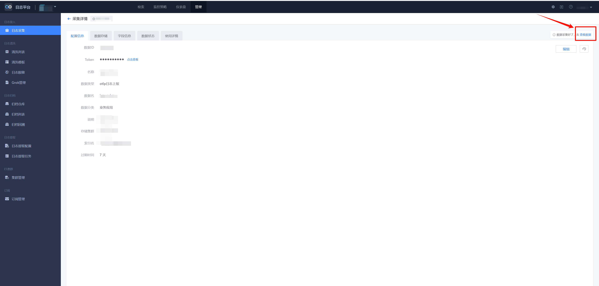
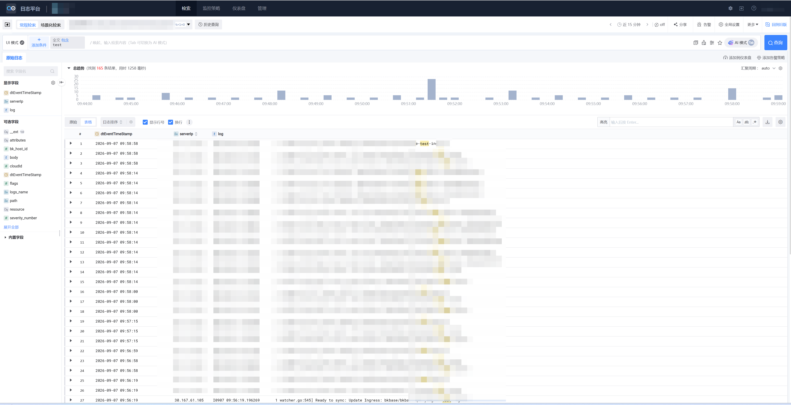

# 自定义日志 OpenTelemetry SDK 上报

## 1. 概述

通过集成 `OpenTelemetry SDK`，应用可将业务日志低成本地接入蓝鲸日志平台，无需部署额外采集器。

接入流程仅需两步：

* 1、新建数据源：登录蓝鲸日志平台，进入「日志采集」，新建日志数据源并获取 `Token` 和上报地址。
* 2、SDK 接入鉴权：在代码中配置 `Token` 和上报地址，通过 `OpenTelemetry SDK` 完成日志采集与上报。

**注： `Token` 等配置需采用外部化配置（如配置文件／环境变量），禁止硬编码。**

## 2. 准备开始

### 2.1 新建自定义日志

参考以下步骤创建自定义日志数据源：

1. 登录蓝鲸日志平台，进入「日志采集」页面。
2. 点击新建，配置采集名、数据分类、数据名和所属索引集（基础信息），操作可参考下图左侧示例。
3. 配置存储集群、数据链路和存储参数（存储设置），操作可参考下图右侧示例。
4. 提交后记录生成的 `Token` 和上报地址。

| 基础信息 | 存储设置 |
| --- | --- |
|  |  |

### 2.2 上报速率限制

OTLP 日志上报注意 API 频率限制 50,000 条/s。

如超过频率限制，请联系`蓝鲸助手`调整。

## 3. 快速接入

### 3.1 数据上报示例

* 了解 <a href="{{docs.logs.learn.sdk_python}}" target="_blank">Python-日志（OpenTelemetry SDK）上报</a>。

* 了解 <a href="{{docs.logs.learn.sdk_c}}" target="_blank">C++-日志（OpenTelemetry SDK）上报</a>。

* 了解 <a href="{{docs.logs.learn.sdk_java}}" target="_blank">Java-日志（OpenTelemetry SDK）上报</a>。

* 了解 <a href="{{docs.logs.learn.sdk_go}}" target="_blank">Go-日志（OpenTelemetry SDK）上报</a>。

另一种方式是通过 HTTP 上报自定义日志：

* 了解 <a href="{{docs.logs.http.readme.http_python}}" target="_blank">Python-日志（HTTP）上报</a>。

* 了解 <a href="{{docs.logs.http.readme.http_c}}" target="_blank">C++-日志（HTTP）上报</a>。

* 了解 <a href="{{docs.logs.http.readme.http_java}}" target="_blank">Java-日志（HTTP）上报</a>。

* 了解 <a href="{{docs.logs.http.readme.http_go}}" target="_blank">Go-日志（HTTP）上报</a>

### 3.2 查看数据

日志上报成功后，可以通过以下入口查看数据：

* **日志采集页面**：进入「采集详情 → 查看数据」，输入关键词即可查看到上报的日志。

* **日志检索页面**：进入「日志平台 → 检索」，在检索条件中切换至对应的索引集，即可查看到上报的日志。

> 如短时间内没有看到数据，可参考 <a href="#4-常见问题" target="_blank">常见问题</a> 中的排查步骤。

## 4. 常见问题

### 4.1 FAQ

#### 4.1.1 HTTP 返回成功后，为什么页面没有看到日志？

Q：请求返回成功，为什么页面没有看到日志？

A：HTTP 成功只代表接收侧已处理请求，不等于数据已经完成入库和索引刷新。请等待一段时间后重试，并检查 `TOKEN`、`API_URL`、数据链路、索引集和日志时间字段。

#### 4.1.2 上报后页面没有数据，如何排查？

Q：已经根据指引完成了 SDK 接入和上报，但在页面上查不到日志数据，应该从哪些方向排查？

A：请按以下顺序逐一排查：

1. **检查 `Token` 和上报地址**
   * 确认 `TOKEN` 与页面新建数据源时生成的 Token 一致。
   * 确认 `API_URL` 为页面接入指引提供的上报地址，OTLP HTTP 上报需要使用 `/v1/logs` 路径。

2. **检查时间戳**
   * 确认 `timeUnixNano` 为当前时间附近的纳秒时间戳，时间偏差过大会导致数据检索不到。

3. **检查索引集匹配**
   * 确认日志的 `service.name` 资源属性与页面配置的索引集规则一致，确保日志能被正确路由到目标索引集。

4. **检查数据链路与网络**
   * 确认数据链路与页面配置一致。
   * 确认业务网络策略未阻断 SDK 到蓝鲸日志平台上报地址的通信，如存在防火墙或代理，需配置白名单。

5. **检查 SDK 配置**
   * 确认 SDK 配置的 `log_level` 未过滤掉目标级别的日志（例如配置为 ERROR 时，INFO 级别的日志不会上报）。
   * 检查 SDK 启动日志，确认 SDK 初始化成功且与蓝鲸日志平台建立连接正常。

#### 4.1.3 什么时候用 Resources，什么时候用 Attributes？

Q：Resources 和 Attributes 都能放字段，应该怎么选择？

A：描述产生日志的实体时放到 Resources，例如服务名、环境、Pod 名称。描述某条日志事件本身时放到 Attributes，例如接口路径、请求方法、异常类型。

### 4.2 更多问题

* <a href="{{docs.logs.faq_no_data}}" target="_blank">自定义日志无数据</a>。

## 5. 了解更多

进一步了解以下内容：

* 进行 <a href="{{docs.logs.learn_search}}" target="_blank">日志检索</a>。

* 了解 <a href="{{docs.logs.container_custom_report}}" target="_blank">容器日志自定义上报使用文档</a>。

* 了解 <a href="{{docs.logs.container_collector_install}}" target="_blank">容器日志采集器安装</a>。
