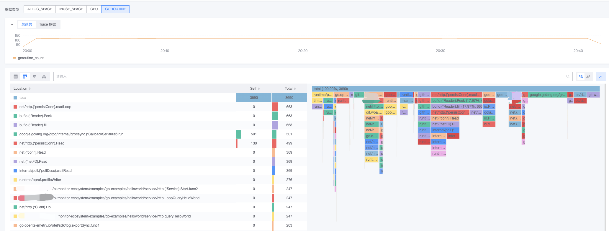

# Profiling-Go（Pyroscope SDK）接入

{{PROFILING_OVERVIEW}}

## 1. 前置准备

### 1.1 术语介绍

{{TERM_INTRO}}

### 1.2 开发环境要求

在开始之前，请确保您已经安装了以下软件：
* Git
* Go 1.21 或更高版本

### 1.3 初始化 demo

```shell
git clone {{ECOSYSTEM_REPOSITORY_URL}}
cd {{ECOSYSTEM_REPOSITORY_NAME}}/examples/go-examples/helloworld
docker build -t helloworld-go:latest .
```

## 2. 快速体验

### 2.1 运行样例

{{PROFILING_RUN_PARAMETERS}}

复制以下命令参数在你的终端运行：

```shell
docker run -e TOKEN="{{access_config.token}}" \
-e SERVICE_NAME="{{service_name}}" \
-e PROFILING_ENDPOINT="{{access_config.profiling.endpoint}}" \
-e ENABLE_PROFILING="{{access_config.profiling.enabled}}" helloworld-go:latest
```
* 样例已设置定时请求以产生监控数据，如需本地访问调试，可增加运行参数 `-p {本地端口}:8080`。

### 2.2 查看数据

等待片刻，便可在「服务详情-Profiling」看到应用数据。



## 3. 快速接入

### 3.1 Pyroscope SDK

{{MUST_CONFIG_PROFILING}}

在项目中引入模块依赖：

```shell
go get github.com/grafana/pyroscope-go@v1.1.2
```

示例项目提供集成 Pyroscope Go SDK 并将性能数据发送到 bk-collector 的方式，可以参考 <a href="{{ECOSYSTEM_CODE_ROOT_URL}}/examples/go-examples/helloworld/service/profiling/profiling.go" target="_blank">service/profiling/profiling.go</a> 进行接入:

```go
profiler, _ = pyroscope.Start(
    pyroscope.Config{
        //❗❗【非常重要】请传入应用 Token
        AuthToken: s.config.Token,
        //❗❗【非常重要】应用服务唯一标识
        ApplicationName: s.config.ServiceName,
        //❗❗【非常重要】数据上报地址，请根据页面指引提供的接入地址进行填写
        ServerAddress: s.config.Addr,
        Logger:        pyroscope.StandardLogger,
        ProfileTypes: []pyroscope.ProfileType{
            pyroscope.ProfileCPU
        }
    }
)
```

参考官方文档以获得更多信息：<a href="https://grafana.com/docs/pyroscope/latest/configure-client/language-sdks/go_push/" target="_blank">Configure the client to send profiles - Go</a>

### 3.2 关联 Traces 数据

Pyroscope 支持同 OpenTelemetry 集成，将 Traces 和 Profiling 数据链接起来，从而实现分析具体跨度（Span）的资源使用情况的目的。

在开始之前，可以阅读文档 <a href="{{ECOSYSTEM_CODE_ROOT_URL}}/examples/go-examples/helloworld/README.md" target="_blank">Go（OpenTelemetry SDK）接入</a> 了解 OpenTelemetry。

在项目中引入依赖：

```shell
# Make sure you also upgrade pyroscope server to version 0.14.0 or higher.
go get github.com/grafana/otel-profiling-go@v0.5.1
```

示例项目在 <a href="{{ECOSYSTEM_CODE_ROOT_URL}}/examples/go-examples/helloworld/service/otlp/otlp.go" target="_blank">service/otlp/otlp.go setUpTraces</a> 提供了创建样例：

```go
// setUpTraces
func (s *Service) setUpTraces(ctx context.Context, res *resource.Resource) error {
	if !s.config.EnableTraces {
		return nil
	}

	tracerExporter, err := s.newTracerExporter(ctx)
	if err != nil {
		return err
	}
	s.tracerProvider = newTracerProvider(res, tracerExporter)
	s.wg.Add(1)

	if s.config.EnableProfiling {
		// 关键代码，注入 otelpyroscope TracerProvider
		otel.SetTracerProvider(otelpyroscope.NewTracerProvider(s.tracerProvider))
	} else {
		otel.SetTracerProvider(s.tracerProvider)
	}

	otel.SetTextMapPropagator(newPropagator())
	otel.SetErrorHandler(otel.ErrorHandlerFunc(func(err error) {
		log.Printf("[otel] error: %v", err)
	}))

	return nil
}
```

如果是<a href="{{ REFER_GOLANG_TRPC_OTEAM_URL }}" target="_blank">Go（tRPC 云观 Oteam SDK）接入</a>，可在 `pyroscope.Start` 位置添加如下代码（需要 SDK 版本在 `0.6.3` 及以上）

```go
// import 部分
// "go.opentelemetry.io/otel"
// otelpyroscope "github.com/grafana/otel-profiling-go"
// oteltrpctrace "opentelemetry/opentelemetry-go-ecosystem/instrumentation/oteltrpc/traces"

tracerProvider := otel.GetTracerProvider()
otel.SetTracerProvider(otelpyroscope.NewTracerProvider(tracerProvider))
oteltrpctrace.SetDefaultTracer(otel.Tracer(""))

// profiler, _ := pyroscope.Start(
// 	pyroscope.Config{
// 		... ...
// 	})
```

参考官方文档以获得更多信息：<a href="https://grafana.com/docs/pyroscope/latest/configure-client/trace-span-profiles/go-span-profiles/" target="_blank">Span profiles with Traces to profiles for Go</a>

## 4. 了解更多

{{LEARN_MORE}}
