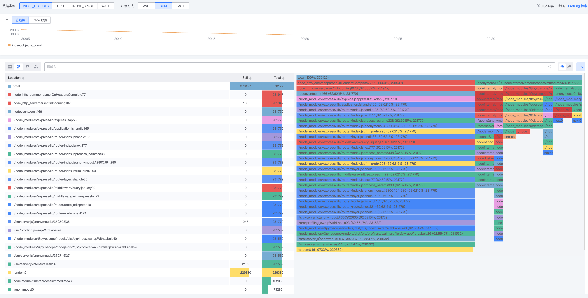

# Profiling-JavaScript（Pyroscope SDK）接入

本指南将帮助您使用 Pyroscope Node.js SDK 接入蓝鲸应用性能监控，以入门项目-Profiling 为例，介绍性能分析数据接入及 SDK 使用场景。

## 1. 前置准备

### 1.1 术语介绍

{{TERM_INTRO}}

### 1.2 开发环境要求

在开始之前，请确保您已经安装了以下软件：
* Git
* Docker 或者其他平替的容器工具。
* 若本地直接运行，需要 Node.js `20.20.2` 或更高版本。当前 `@pyroscope/nodejs@0.6.3` 声明了该最低版本，样例 Docker 镜像使用 Node 22。

### 1.3 初始化 demo

```shell
git clone {{ECOSYSTEM_REPOSITORY_URL}}
cd {{ECOSYSTEM_REPOSITORY_NAME}}/examples/js-examples/profiling
docker build -t profiling-js:latest .
```

## 2. 快速体验

### 2.1 运行样例

{{PROFILING_RUN_PARAMETERS}}

复制以下命令参数在你的终端运行：

```shell
docker run -e TOKEN="{{access_config.token}}" \
-e SERVICE_NAME="{{service_name}}" \
-e PROFILING_ENDPOINT="{{access_config.profiling.endpoint}}" \
-e ENABLE_PROFILING="{{access_config.profiling.enabled}}" profiling-js:latest
```
* 样例已设置定时请求以产生监控数据，如需本地访问调试，可增加运行参数 `-p {本地端口}:8080`。

### 2.2 查看数据

等待片刻，便可在「服务详情-Profiling」看到应用数据。



## 3. 快速接入

### 3.1 Pyroscope SDK

{{MUST_CONFIG_PROFILING}}

Node.js SDK 对应字段为 `authToken`、`appName`、`serverAddress`。Token 通过 `Authorization: Bearer` 发送，与 Go / Java Pyroscope SDK 的 `AuthToken` 一致。

在项目中引入模块依赖：

```shell
npm install @pyroscope/nodejs@0.6.3
```

示例项目提供集成 Pyroscope Node.js SDK 并将性能数据发送到 bk-collector 的方式，可以参考 <a href="{{ECOSYSTEM_CODE_ROOT_URL}}/examples/js-examples/profiling/src/profiling.js" target="_blank">src/profiling.js</a> 进行接入：

```javascript
const Pyroscope = require('@pyroscope/nodejs');

Pyroscope.init({
    // ❗❗【非常重要】请传入应用 Token
    authToken: config.token,
    // ❗❗【非常重要】应用服务唯一标识
    appName: config.serviceName,
    // ❗❗【非常重要】数据上报地址，请根据页面指引提供的接入地址进行填写
    serverAddress: config.profilingEndpoint,
    wall: {
        collectCpuTime: true,
    },
    heap: {
        samplingIntervalBytes: 524288,
        stackDepth: 64,
    },
});
Pyroscope.start();
```

参考官方文档以获得更多信息：<a href="https://grafana.com/docs/pyroscope/latest/configure-client/language-sdks/nodejs/" target="_blank">Configure the client to send profiles - Node.js</a>

### 3.2 采集类型

Node.js SDK 支持的采集类型为 CPU、Wall、Heap，与官方 <a href="https://grafana.com/docs/pyroscope/latest/configure-client/profile-types/" target="_blank">Profile types</a> 表一致。不支持 Goroutine、Mutex、Block 等类型。

| 采集类型 | 说明 |
|----------|------|
| CPU | 需设置 `wall.collectCpuTime: true`，否则页面看不到 CPU profile |
| Wall | 墙钟采样，`Pyroscope.start()` 默认启动 |
| Heap | 堆内存采样，`Pyroscope.start()` 默认启动 |

`Pyroscope.start()` 会同时启动 wall（含 CPU）和 heap。如只需其中一类，可改为 `startWallProfiling()` 或 `startHeapProfiling()`。

完整采样参数（上报周期、wall / heap 采样间隔等）见 <a href="{{ECOSYSTEM_CODE_ROOT_URL}}/examples/js-examples/profiling/src/profiling.js" target="_blank">src/profiling.js</a>。

### 3.3 动态标签

Wall / CPU profile 支持动态标签，用于区分不同代码路径。

示例项目在 <a href="{{ECOSYSTEM_CODE_ROOT_URL}}/examples/js-examples/profiling/src/server.js" target="_blank">src/server.js</a> 提供了创建样例：

```javascript
Pyroscope.wrapWithLabels({ handler: 'tasks' }, () => {
    intensiveTask();
});
```

参考官方文档以获得更多信息：<a href="https://grafana.com/docs/pyroscope/latest/configure-client/language-sdks/nodejs/" target="_blank">Dynamic labels for Wall/CPU profiles</a>

## 4. 了解更多

{{LEARN_MORE}}
