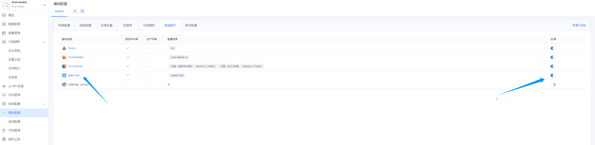
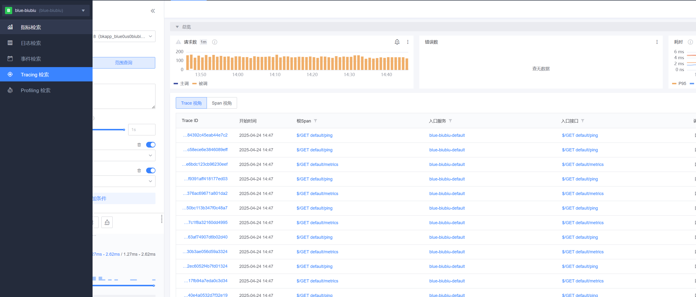
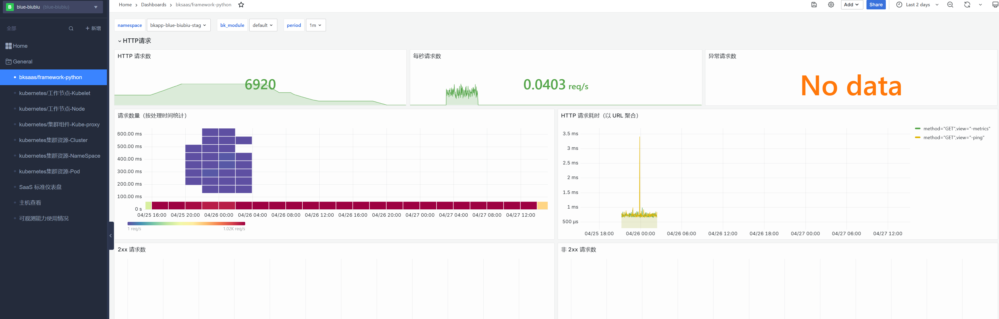
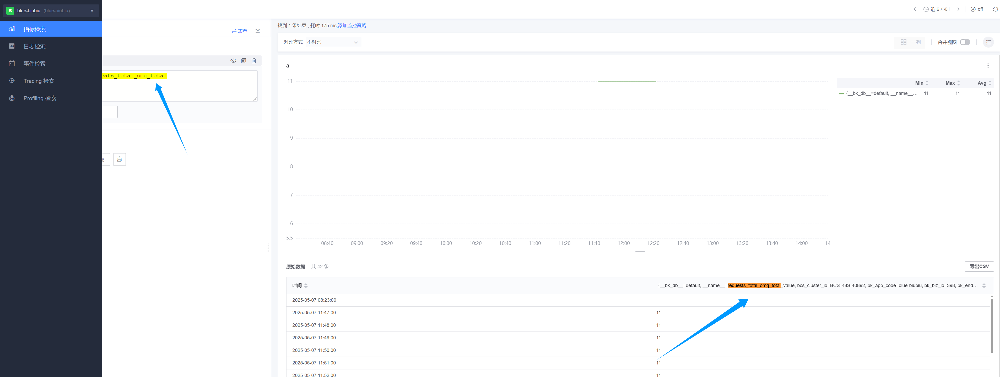

# Python (蓝鲸 SaaS 开发框架 blueapps 4.x) 接入

本指南将帮助您使用 **`blueapps` 框架**接入蓝鲸应用性能监控，并体验蓝鲸应用性能监控相关功能。

## 1. 前置准备

### 1.1 术语介绍

{{TERM_INTRO}}

## 2. 快速接入

### 2.1 安装依赖

```python
blueapps[opentelemetry]==4.16rc1
```

### 2.2 修改 Django 配置

```python
INSTALLED_APPS += (
    "blueapps.opentelemetry.instrument_app", #  注册应用
)

ENABLE_OTEL_METRICS = True # 是否开启metrics

ENABLE_OTEL_TRACE = True # 是否开启 trace

BK_APP_OTEL_INSTRUMENT_DB_API = True # 是否开启 DB 访问 trace（开启后 span 数量会明显增多）

# 日志中TRACE信息：可自定义格式，非必填，以默认值为例
OTEL_LOGGING_TRACE_FORMAT = "[trace_id]: %(otelTraceID)s [span_id]: %(otelSpanID)s [resource.service.name]: %(otelServiceName)s"
```

### 2.3 暴露 metrics 端口

```python
# views.py
from django_prometheus import exports
from blueapps.account.decorators import login_exempt

@login_exempt
def metrics(request):
	return exports.ExportToDjangoView(request)

# urls.py
url(r"^metrics/$", views.metrics)
```

### 2.4 metrics 上报

#### 2.4.1 自定义业务指标

```python
# views.py

from prometheus_client import Counter
from django.http import HttpResponse

# 创建 Counter 实例
requests_total_omg = Counter(
    'requests_total_omg',
    'Total HTTP Requests',
    ['method', 'endpoint']
)

def custom_metrics(request):
    # 在每次请求时增加计数
    requests_total_omg.labels(method=request.method, endpoint=request.path).inc()
    return HttpResponse("custom_metrics")

# urls.py
re_path(r"^custom_metrics/$", views.custom_metrics,name="custom_metrics"),
```

### 2.5 修改 app_desc.yaml

如果没有 app_desc.yaml 文件，则新建，并添加以下内容。

如果已有 app_desc.yaml 文件，则使用下面的内容覆盖。

```python
# 开启 mertric 端口后监听端口会冲突，需要修改 app_desc.yaml 文件
specVersion: 3
module:
  language: Python
  spec:
    processes:
      - name: web
        procCommand: gunicorn wsgi -w 4 -b [::]:5000 --access-logfile - --error-logfile - --access-logformat '[%(h)s] %({request_id}i)s %(u)s %(t)s "%(r)s" %(s)s %(D)s %(b)s "%(f)s" "%(a)s"' --env prometheus_multiproc_dir=/tmp/
        services:
          - name: web
            exposedType:
              name: bk/http
            targetPort: 5000
            port: 80
          # 给 metrics 采集使用的端口
          - name: metrics
            targetPort: 5001
            port: 5001
    hooks:
      preRelease:
        procCommand: "python manage.py migrate --no-input"
    observability:
      monitoring:
        # metrics 采集配置，注意 serviceName 要与 processes 中定义的保持一致
        metrics:
          - process: web
            serviceName: metrics
            path: /metrics/
```

### 2.6 部署

在**蓝鲸开发者中心**部署，部署到预发布环境

## 3. 使用场景

### 3.1 上报业务指标

部署后，并开启 APM 增强服务



## 4. 快速体验

### 4.1 查看 traces

{{BLUE_APPS4_TRACE_RUN_PARAMETERS}}



### 4.2 查看 metrics

#### 4.2.1 在仪表盘查看

{{BLUE_APPS4_METRICS_RUN_PARAMETERS}}



#### 4.2.2 查看自定义的业务指标

{{BLUE_APPS5_METRICS_DATA_RUN_PARAMETERS}}

