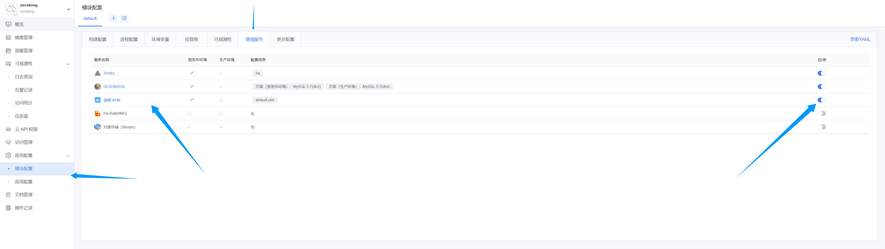
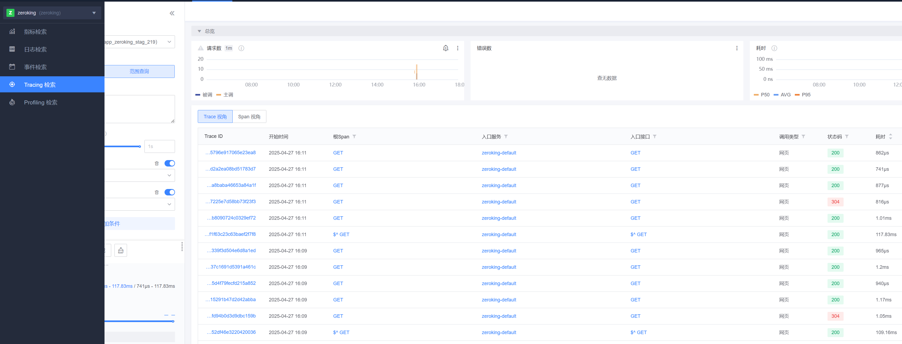
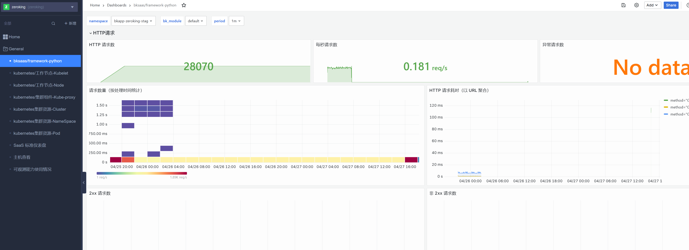
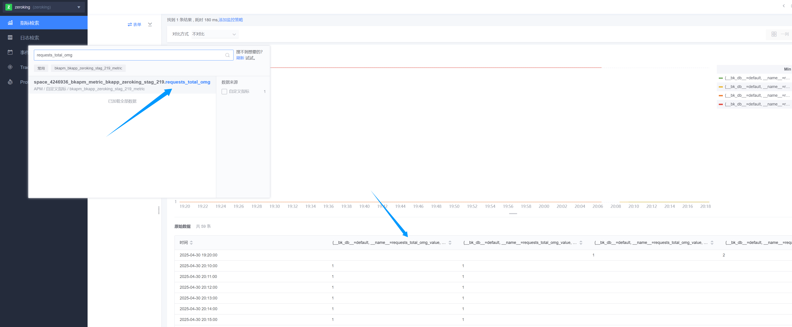
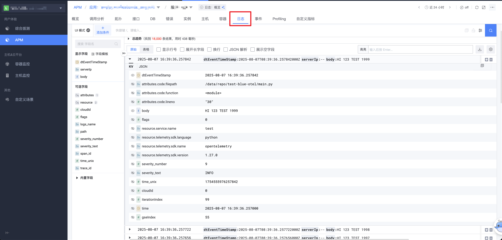
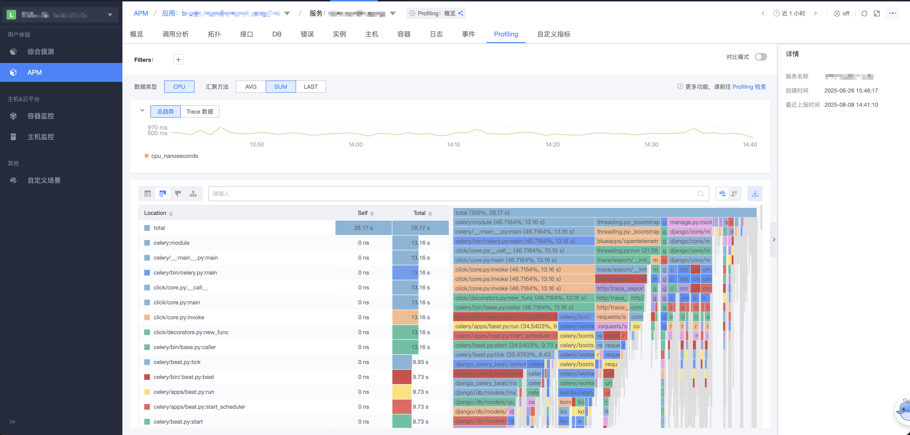

# Python (蓝鲸 SaaS 开发框架 blueapps 5.x) 接入

本指南将帮助您使用 **`blueapps` 框架**接入蓝鲸应用性能监控，并体验蓝鲸应用性能监控相关功能。

## 1. 前置准备

### 1.1 术语介绍

{{TERM_INTRO}}

## 2. 快速接入

### 2.1 安装依赖

```python
blueapps[opentelemetry]==5.0.0rc6
```

### 2.2 修改 Django 配置

```python
INSTALLED_APPS += (
    "blueapps.opentelemetry.trace", # 注册应用, 按实际所需添加
    "blueapps.opentelemetry.metric",
    "blueapps.opentelemetry.logs",
)

ENABLE_OTEL_METRIC = True # 是否开启 metrics

ENABLE_OTEL_TRACE = True # 是否开启 trace

ENABLE_OTEL_LOG = True # 是否开启 log

BKAPP_OTEL_INSTRUMENT_DB_API = True # 是否开启 DB 访问 trace（开启后 span 数量会明显增多）

# 日志中TRACE信息：可自定义格式，非必填，以默认值为例
BKAPP_OTEL_LOGGING_TRACE_FORMAT = "[trace_id]: %(otelTraceID)s [span_id]: %(otelSpanID)s [resource.service.name]: %(otelServiceName)s"
```

### 2.3 Metrics 上报

#### 2.3.1 自定义业务指标

```python
from opentelemetry import metrics
# 获取 Meter 实例
meter = metrics.get_meter(__name__)

# 创建 Counters（计数器）
requests_total_omg = meter.create_counter(
    "requests_total_omg",
    description="Total number of HTTP requests",
)

def metrics_counter_demo(country: str):
    """记录HTTP请求总数，并将国家作为标签."""
    requests_total_omg.add(1, {"country": country})

def custom_metrics(request):
    """自定义指标统计函数."""
    metrics_counter_demo("American")  # 如果需要动态值，可以从 request 中获取
    return HttpResponse("custom metrics")

# urls.py
re_path(r"^custom_metrics/$", views.custom_metrics,name="custom_metrics"),
```

### 2.4 Log 上报

开启了 `ENABLE_OTEL_LOG` 配置项后, logging 模块打印的日志会被上报

```python
import logging

logger = logging.getLogger(__name__)


def log_demo():
    logger.info("[log_demo] this is a line of log")
```

### 2.5 Profiling 上报

在 bkmonitor 的观测场景-新建应用页面, 获取到对应的 `PROFILING_ENDPOINT`

将 `PROFILING_ENDPOINT` 配置为环境变量, 并作为 Pyroscope 实例初始化参数

#### 安装 pyroscope

```shell
$ pip install pyroscope-io
```

#### 配置示例

django 项目可以放在 config/default.py 下配置,
OTEL_BK_DATA_TOKEN 和 BKPAAS_ENVIRONMENT是 saas 内置环境变量

```python
from blueapps.settings import blueapps_settings

service_name = blueapps_settings.BKAPP_OTEL_SERVICE_NAME_HANDLER().get_service_name()
pyroscope.configure(
    application_name=service_name,
    server_address=os.environ["PROFILING_ENDPOINT"], # 从 bkmonitor 获取, 然后自行设置为 saas 的环境变量
    tags={
        "service": service_name
        "env": os.environ["BKPAAS_ENVIRONMENT"], # saas 内置环境变量
    },
    http_headers={"X-BK-TOKEN": os.environ["OTEL_BK_DATA_TOKEN"]}, # saas 内置环境变量
)
```

### 2.6 修改 app_desc.yaml

如果没有 app_desc.yaml 文件，则新建，并添加以下内容。

如果已有 app_desc.yaml 文件，则使用下面的内容覆盖。

```python
specVersion: 3
module:
  language: Python
  spec:
    processes:
      - name: web
        procCommand: gunicorn wsgi -w 4 -b [::]:5000 --access-logfile - --error-logfile - --access-logformat '[%(h)s] %({request_id}i)s %(u)s %(t)s "%(r)s" %(s)s %(D)s %(b)s "%(f)s" "%(a)s"' --env prometheus_multiproc_dir=/tmp/
        services:
          - name: web
            exposedType:
              name: bk/http
            targetPort: 5000
            port: 80

    hooks:
      preRelease:
        procCommand: "python manage.py migrate --no-input"
```

### 2.7 部署

在**蓝鲸开发者中心**部署，具体可查看对应的文档

## 3. 使用场景

### 3.1 上报业务指标

部署后，并开启 APM 增强服务



## 4. 快速体验

### 4.1 查看 Traces

{{BLUE_APPS4_TRACE_RUN_PARAMETERS}}



### 4.2 查看 Metrics

#### 4.2.1 在仪表盘查看

{{BLUE_APPS5_METRICS_RUN_PARAMETERS}}



#### 4.2.2 查看自定义的业务指标

{{BLUE_APPS5_METRICS_DATA_RUN_PARAMETERS}}



### 4.3 查看 Logs


### 4.4 查看 Profiling


