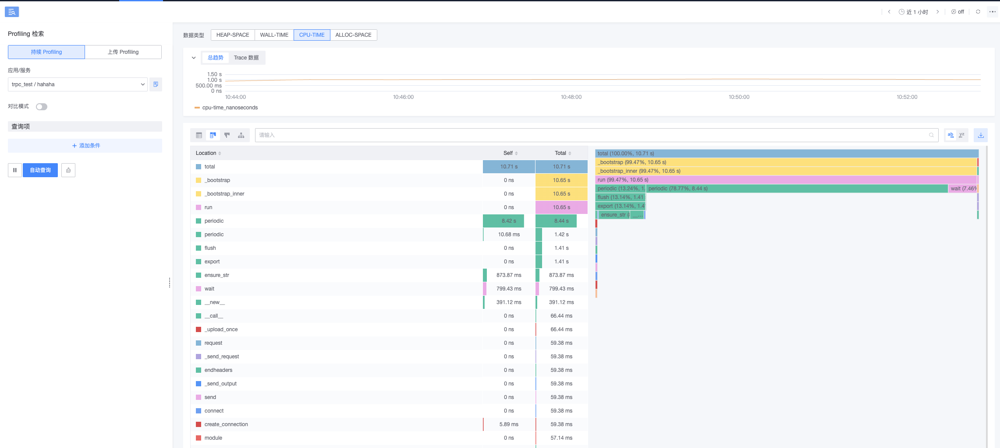

# Profiling-Python（Pyroscope SDK）接入

本指南将帮助您使用 Pyroscope SDK 接入蓝鲸应用性能监控，以入门项目-Profiling 为例，介绍性能分析数据接入及 SDK 使用场景。

## 1. 前置准备

### 1.1 术语介绍

{{TERM_INTRO}}

### 1.2 开发环境要求

在开始之前，请确保您已经安装了以下软件：
* Git
* Docker 或者其他平替的容器工具。

### 1.3 初始化 demo

```shell
git clone {{ECOSYSTEM_REPOSITORY_URL}}
cd {{ECOSYSTEM_REPOSITORY_NAME}}/examples/python-examples/profiling
docker build -t profiling-python:latest .
```

## 2. 快速接入

### 2.1 创建应用

{{PROFILING_APPLICATION_SET_UP}}

### 2.2 环境依赖

安装 `pyroscope-io` 包：

```shell
pip install pyroscope-io==0.8.8
```

### 2.3 Pyroscope SDK

示例项目使用 <a href="https://grafana.com/docs/pyroscope/latest/configure-client/language-sdks/python/" target="_blank">pyroscope-io</a> 指定的配置方式，将性能数据发送到 bk-collector。

可以参考 `main.py` 文件进行接入:

```python
import pyroscope

pyroscope.configure(
    # 服务名，一个应用可以有多个服务，通过该属性区分。
    application_name=config.service_name,
    # ❗❗【非常重要】数据上报地址，请根据页面指引提供的 Profiling 接入地址进行填写
    server_address=config.endpoint,
    tags={
        "service.name": config.service_name,
        "service.version": "0.1",
        "service.environment": "dev",
        "net.host.ip": "127.0.0.1",
        "net.host.name": "localhost",
    },
    http_headers={
        # ❗❗【非常重要】`X-BK-TOKEN` 是蓝鲸 APM 在接收端的凭证，请传入应用真实 Token，否则数据无法正常上报到 APM。
        "X-BK-TOKEN": config.token,
    },
)
```

## 3. 快速体验

### 3.1 运行样例

{{PROFILING_RUN_PARAMETERS}}

复制以下命令参数在你的终端运行：

```shell
docker run -e TOKEN="{{access_config.token}}" \
-e SERVICE_NAME="{{service_name}}" \
-e PROFILING_ENDPOINT="{{access_config.profiling.endpoint}}" \
-e ENABLE_PROFILING="{{access_config.profiling.enabled}}" profiling-python:latest
```
* 样例已设置定时请求以产生监控数据，如需本地访问调试，可增加运行参数 `-p {本地端口}:8080`。

### 3.2 查看数据

等待片刻，便可在「服务详情-Profiling」看到应用数据。



## 4. 了解更多

{{LEARN_MORE}}
